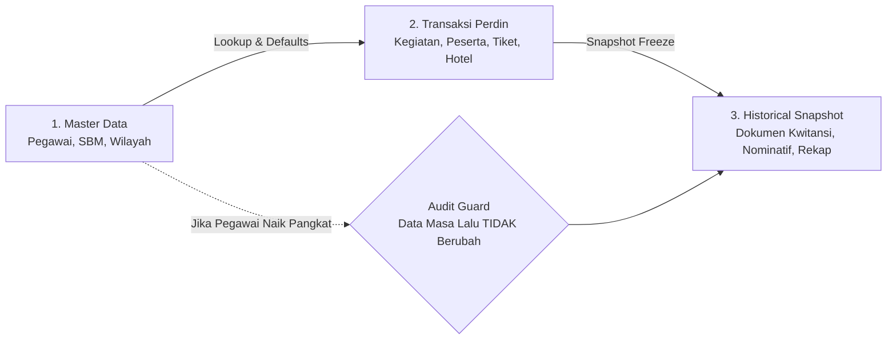

# Perencanaan Struktur Database & Skema Relasional (DATABASE_SCHEMA.md)

## Aplikasi Kalkulator Keuangan, SPPD & Rekap Perdin Inspektorat

### Kementerian Koordinator Bidang Pangan Republik Indonesia

| Dokumen                      | Spesifikasi Arsitektur Database                                               |
| :--------------------------- | :---------------------------------------------------------------------------- |
| **Versi Dokumen**      | 1.0.0                                                                         |
| **Status**             | Blueprint Perencanaan Database Produksi                                       |
| **Target Engine DB**   | PostgreSQL 16+ / SQLite (Local/Edge) / Prisma ORM / Supabase                  |
| **Prinsip Arsitektur** | **3NF Relational + Historical Snapshot Immutability (Audit-Proof SPJ)** |

---

## 1. Prinsip & Filosofi Desain Database Keuangan Negara

Sistem pengelolaan keuangan dan perjalanan dinas pemerintah (SPPD & SPJ) memiliki karakteristik unik yang **tidak boleh disamakan dengan sistem CRUD biasa**:



1. **Historical Snapshot Immutability (Kekebalan Audit BPK/Itjen)**:
   - Apabila seorang pegawai naik golongan dari `III/d` ke `IV/a` atau berganti jabatan di kemudian hari, dokumen SPJ dan Rekap Perdin tahun lalu **tetap harus mencatat golongan dan tarif SBM pada saat dinas tersebut dilaksanakan**.
   - Solusi: Tabel `perdin_peserta` menyimpan referensi `pegawai_id` (FK) sekaligus menyimpan salinan snapshot (`nama_snapshot`, `nip_snapshot`, `golongan_snapshot`, `jabatan_snapshot`).
2. **Modular Cost Components (Extensible Multi-Entity)**:
   - Tiket pesawat/kereta, hotel/penginapan, dan pengeluaran riil disimpan dalam entitas relasional terpisah dengan relasi $1:1$ atau $1:N$ agar tidak terjadi *sparse column explosion* (kolom kosong berlebih pada tabel utama).
3. **High-Performance Projection (Rekap Perdin 48 Kolom)**:
   - Dibuatkan Database View `v_rekap_perdin_lengkap` yang menggabungkan seluruh tabel relasional ke format 48 kolom datar (*flat table*) yang siap diekspor ke Excel tanpa beban komputasi berat di client.

---

## 2. Entity Relationship Diagram (ERD)

```mermaid
erDiagram
    MASTER_PEGAWAI ||--o{ PERDIN_PESERTA : "di-assign ke"
    MASTER_SBM ||--o{ PERDIN_PESERTA : "referensi tarif"
    MASTER_KABKOT ||--o{ PERDIN_KEGIATAN : "lokasi tujuan"
    MASTER_MEMO ||--o{ PERDIN_KEGIATAN : "nomor memorandum"

    PERDIN_KEGIATAN ||--|{ PERDIN_PESERTA : "memiliki banyak pelaksana"
    PERDIN_PESERTA ||--o| PERDIN_TIKET_DETAIL : "rincian tiket pergi/pulang"
    PERDIN_PESERTA ||--o| PERDIN_HOTEL_DETAIL : "rincian penginapan/folio"
    PERDIN_PESERTA ||--o{ PERDIN_RIIL_ITEM : "item pengeluaran riil"
    PERDIN_PESERTA ||--o| PERDIN_SPJ_EXTRA : "data pelengkap SPJ"

    MASTER_PEGAWAI {
        uuid id PK
        string nip UK
        string nama
        string golongan
        string pangkat
        string jabatan
        string unit_kerja
        string nama_bank
        string nomor_rekening
        boolean is_active
    }

    MASTER_SBM {
        uuid id PK
        int tahun_anggaran
        string kode_provinsi
        string nama_provinsi
        numeric uh_biasa
        numeric uh_halfday
        numeric uh_fullboard
        numeric hotel_eselon1
        numeric hotel_eselon2
        numeric hotel_eselon3_gol4
        numeric hotel_eselon4_kebawah
        numeric representatif_luar_kota
        numeric taksi_bandara
    }

    MASTER_MEMO {
        uuid id PK
        int tahun_anggaran
        string prefix
        int nomor_urut
        string kode_unit
        string bulan_romawi
        date tanggal_memo
        text perihal
        string status
    }

    PERDIN_KEGIATAN {
        uuid id PK
        string kode_kegiatan UK
        text nama_kegiatan
        string no_spm
        string no_spby
        enum jenis_pengajuan
        enum jenis_perdin
        string kode_mak
        string kode_komponen
        string berangkat_dari
        string provinsi_tujuan
        text kota_tujuan_list
        date tanggal_mulai
        date tanggal_selesai
        string alat_angkut
        string nomor_st_master
        string nomor_st_staf
        string nomor_st_pejabat
        boolean use_different_st_pejabat
        string nomor_memo
        date tanggal_memo
        date tanggal_spd
        string ppk_nama
        string ppk_nip
        string bendahara_nama
        string verifikator_nama
        numeric grand_total
        enum status_dokumen
    }

    PERDIN_PESERTA {
        uuid id PK
        uuid kegiatan_id FK
        uuid pegawai_id FK
        int urutan
        string nomor_spd
        string nomor_st_assigned
        boolean is_pejabat
        string nama_snapshot
        string nip_snapshot
        string golongan_snapshot
        string jabatan_snapshot
        string tujuan_kota
        date tanggal_mulai
        date tanggal_selesai
        int lama_hari
        int hari_uh_biasa
        numeric biaya_uh_biasa
        int hari_uh_60
        numeric biaya_uh_60
        int hari_uh_halfday
        numeric biaya_uh_halfday
        int hari_uh_fullboard
        numeric biaya_uh_fullboard
        numeric biaya_tiket
        numeric biaya_hotel
        numeric biaya_penginapan_30
        numeric biaya_trans_darat
        numeric biaya_trans_lokal
        numeric biaya_trans_jakarta_pp
        numeric biaya_trans_daerah_pp
        numeric biaya_riil
        numeric biaya_representatif
        numeric biaya_meeting
        numeric biaya_belanja_bahan
        numeric total_biaya
    }

    PERDIN_TIKET_DETAIL {
        uuid id PK
        uuid peserta_id FK
        enum boarding_pass_status
        string pergi_no_tiket
        string pergi_kode_booking
        string pergi_maskapai
        string pergi_no_penerbangan
        string pergi_asal
        string pergi_tujuan
        date pergi_tanggal
        numeric pergi_harga_fare
        string pulang_no_tiket
        string pulang_kode_booking
        string pulang_maskapai
        string pulang_no_penerbangan
        string pulang_asal
        string pulang_tujuan
        date pulang_tanggal
        numeric pulang_harga_fare
        numeric total_fare
    }

    PERDIN_HOTEL_DETAIL {
        uuid id PK
        uuid peserta_id FK
        string nama_hotel
        string kota_hotel
        date tanggal_checkin
        date tanggal_checkout
        string no_bill_folio
        string no_kamar
        int jumlah_malam
        numeric rate_per_malam
        numeric total_biaya_hotel
    }

    PERDIN_RIIL_ITEM {
        uuid id PK
        uuid peserta_id FK
        int urutan
        string uraian
        numeric amount
        string keterangan
    }

    PERDIN_SPJ_EXTRA {
        uuid id PK
        uuid peserta_id FK
        string nama_external
        numeric sewa_kendaraan
        numeric taksi_bandara
        numeric biaya_reschedule
        numeric kurs_valuta
        numeric pengembalian_kas
    }
```



---

## 3. Kamus Data & Spesifikasi Tabel (Data Dictionary)

### 3.1 Kelompok Master Data (Lookup & Reference)

#### 1. Tabel `master_pegawai`

Menyimpan database seluruh pejabat dan pegawai Inspektorat.

| Nama Kolom         | Tipe Data        | Constraint                                      | Keterangan                                            |
| :----------------- | :--------------- | :---------------------------------------------- | :---------------------------------------------------- |
| `id`             | `UUID`         | `PRIMARY KEY`, Default: `gen_random_uuid()` | ID unik internal                                      |
| `kode_nama`      | `VARCHAR(50)`  | `UNIQUE`, `NOT NULL`                        | Kode identifikasi singkat (contoh:`ARIF`, `RENI`) |
| `no_urut`        | `INTEGER`      | `NOT NULL`                                    | Urutan tampilan baku                                  |
| `nama`           | `VARCHAR(255)` | `NOT NULL`                                    | Nama lengkap beserta gelar                            |
| `nip`            | `VARCHAR(30)`  | `UNIQUE`, `NOT NULL`                        | NIP 18 digit resmi                                    |
| `jenis_kelamin`  | `VARCHAR(10)`  | `NOT NULL`                                    | `Laki-laki` / `Perempuan`                         |
| `pangkat`        | `VARCHAR(100)` | `NOT NULL`                                    | Pangkat ASN (contoh:`Pembina`, `Penata`)          |
| `golongan`       | `VARCHAR(20)`  | `NOT NULL`                                    | Golongan ruang (contoh:`IV/b`, `III/d`)           |
| `jabatan`        | `VARCHAR(255)` | `NOT NULL`                                    | Jabatan struktural / fungsional                       |
| `kelas_jabatan`  | `VARCHAR(10)`  | `NULL`                                        | Kelas jabatan (contoh:`14`, `11`)                 |
| `nama_bank`      | `VARCHAR(100)` | `NULL`                                        | Bank payroll (contoh:`Bank Mandiri`)                |
| `nomor_rekening` | `VARCHAR(50)`  | `NULL`                                        | Nomor rekening pembayaran                             |
| `is_active`      | `BOOLEAN`      | `DEFAULT TRUE`                                | Status aktif pegawai                                  |
| `created_at`     | `TIMESTAMPTZ`  | `DEFAULT NOW()`                               | Waktu pembuatan                                       |
| `updated_at`     | `TIMESTAMPTZ`  | `DEFAULT NOW()`                               | Waktu pembaruan                                       |

---

#### 2. Tabel `master_sbm` (Standar Biaya Masukan PMK)

Menyimpan tarif resmi Uang Harian, Penginapan, dan Transport berdasarkan Peraturan Menteri Keuangan.

| Nama Kolom                  | Tipe Data         | Constraint                      | Keterangan                                |
| :-------------------------- | :---------------- | :------------------------------ | :---------------------------------------- |
| `id`                      | `UUID`          | `PRIMARY KEY`                 | ID unik                                   |
| `tahun_anggaran`          | `INTEGER`       | `NOT NULL` (Contoh: `2026`) | Berlaku per tahun anggaran                |
| `nama_provinsi`           | `VARCHAR(100)`  | `NOT NULL`                    | Nama Provinsi (contoh:`JAWA BARAT`)     |
| `uh_biasa`                | `NUMERIC(15,2)` | `NOT NULL`                    | Uang Harian Luar Kota 100%                |
| `uh_halfday`              | `NUMERIC(15,2)` | `NOT NULL`                    | Uang Saku Paket Rapat Halfday/Fullday     |
| `uh_fullboard`            | `NUMERIC(15,2)` | `NOT NULL`                    | Uang Saku Paket Rapat Fullboard           |
| `hotel_eselon1`           | `NUMERIC(15,2)` | `NOT NULL`                    | Batas tarif hotel Pejabat Eselon I        |
| `hotel_eselon2`           | `NUMERIC(15,2)` | `NOT NULL`                    | Batas tarif hotel Pejabat Eselon II       |
| `hotel_eselon3_gol4`      | `NUMERIC(15,2)` | `NOT NULL`                    | Batas tarif hotel Eselon III / Gol. IV    |
| `hotel_eselon4_kebawah`   | `NUMERIC(15,2)` | `NOT NULL`                    | Batas tarif hotel Eselon IV / Gol. III/II |
| `representatif_luar_kota` | `NUMERIC(15,2)` | `DEFAULT 0`                   | Uang representatif pejabat per hari       |
| `taksi_bandara`           | `NUMERIC(15,2)` | `DEFAULT 0`                   | Standar taksi bandara                     |

---

#### 3. Tabel `master_nomor_memo`

Menyimpan register penomoran nota dinas/memorandum pengajuan biaya.

| Nama Kolom         | Tipe Data        | Constraint        | Keterangan                        |
| :----------------- | :--------------- | :---------------- | :-------------------------------- |
| `id`             | `UUID`         | `PRIMARY KEY`   | ID unik                           |
| `tahun_anggaran` | `INTEGER`      | `NOT NULL`      | Tahun berjalan (2026)             |
| `nomor_urut`     | `INTEGER`      | `NOT NULL`      | Nomor urut angka (contoh:`269`) |
| `format_lengkap` | `VARCHAR(100)` | `NOT NULL`      | `M.269/INS/PPK/VIII/2026`       |
| `perihal`        | `TEXT`         | `NOT NULL`      | Ringkasan perihal dinas           |
| `tanggal_memo`   | `DATE`         | `NOT NULL`      | Tanggal penerbitan                |
| `is_used`        | `BOOLEAN`      | `DEFAULT FALSE` | Penanda status penggunaan         |

---

### 3.2 Kelompok Transaksi Perjalanan Dinas (Header & Detail)

#### 4. Tabel `perdin_kegiatan` (Header Transaksi)

Menyimpan identitas satu paket kegiatan perjalanan dinas.

| Nama Kolom                   | Tipe Data         | Constraint                     | Keterangan                                          |
| :--------------------------- | :---------------- | :----------------------------- | :-------------------------------------------------- |
| `id`                       | `UUID`          | `PRIMARY KEY`                | ID unik kegiatan                                    |
| `kode_kegiatan`            | `VARCHAR(50)`   | `UNIQUE`, `NOT NULL`       | Kode kegiatan sistem                                |
| `nama_kegiatan`            | `TEXT`          | `NOT NULL`                   | Keterangan lengkap maksud dinas                     |
| `jenis_pengajuan`          | `VARCHAR(20)`   | `DEFAULT 'RAMPUNG'`          | `RENCANA` / `RAMPUNG` / `MERAMPUNGKAN`        |
| `no_spm`                   | `VARCHAR(50)`   | `NULL`                       | Nomor SPM (contoh:`00073T`)                       |
| `no_spby`                  | `VARCHAR(50)`   | `NULL`                       | Nomor SPBY                                          |
| `jenis_perdin`             | `VARCHAR(50)`   | `DEFAULT 'Perdin Luar Kota'` | `Perdin Jabodetabekdung` / `Luar Kota` / `LN` |
| `berangkat_dari`           | `VARCHAR(100)`  | `DEFAULT 'Jakarta'`          | Kota asal keberangkatan                             |
| `provinsi_tujuan`          | `VARCHAR(100)`  | `NOT NULL`                   | Provinsi tujuan SBM                                 |
| `kota_tujuan_list`         | `JSONB`         | `DEFAULT '[]'`               | Array kota tujuan dinas                             |
| `tanggal_mulai`            | `DATE`          | `NOT NULL`                   | Tanggal dinas dimulai                               |
| `tanggal_selesai`          | `DATE`          | `NOT NULL`                   | Tanggal dinas berakhir                              |
| `alat_angkut`              | `VARCHAR(50)`   | `DEFAULT 'Angkutan Darat'`   | `Angkutan Darat` / `Udara` / `Kombinasi`      |
| `nomor_st_master`          | `VARCHAR(100)`  | `NULL`                       | Nomor Surat Tugas induk                             |
| `nomor_st_staf`            | `VARCHAR(100)`  | `NULL`                       | Nomor ST Staf                                       |
| `nomor_st_pejabat`         | `VARCHAR(100)`  | `NULL`                       | Nomor ST khusus Pejabat (jika beda)                 |
| `use_different_st_pejabat` | `BOOLEAN`       | `DEFAULT FALSE`              | Flag pemisah ST Pejabat                             |
| `nomor_memo`               | `VARCHAR(100)`  | `NOT NULL`                   | Nomor Memorandum pengajuan                          |
| `tanggal_memo`             | `DATE`          | `NOT NULL`                   | Tanggal Memorandum                                  |
| `tanggal_spd`              | `DATE`          | `NOT NULL`                   | Tanggal SPD resmi                                   |
| `kode_mak`                 | `VARCHAR(50)`   | `DEFAULT '524111'`           | Akun MAK APBN                                       |
| `kode_komponen`            | `VARCHAR(50)`   | `DEFAULT '051'`              | Sub Kegiatan / Komponen                             |
| `item_detail`              | `VARCHAR(20)`   | `DEFAULT '001'`              | Item detail belanja                                 |
| `unit_kerja`               | `VARCHAR(100)`  | `DEFAULT 'INSPEKTORAT'`      | Unit kerja pemilik kegiatan                         |
| `ppk_nama`                 | `VARCHAR(255)`  | `NOT NULL`                   | Nama PPK penandatangan                              |
| `ppk_nip`                  | `VARCHAR(30)`   | `NOT NULL`                   | NIP PPK                                             |
| `ppk_jabatan`              | `VARCHAR(255)`  | `NOT NULL`                   | Jabatan struktural PPK                              |
| `bendahara_nama`           | `VARCHAR(255)`  | `NOT NULL`                   | Nama Bendahara Pengeluaran                          |
| `verifikator_nama`         | `VARCHAR(255)`  | `NULL`                       | Nama Petugas Verifikasi                             |
| `grand_total`              | `NUMERIC(15,2)` | `DEFAULT 0`                  | Total biaya seluruh peserta                         |
| `status_dokumen`           | `VARCHAR(20)`   | `DEFAULT 'DRAFT'`            | `DRAFT` / `FINAL` / `SPJ_RAMPUNG`             |

---

#### 5. Tabel `perdin_peserta` (Baris Pelaksana & Snapshot Keuangan)

Menyimpan daftar peserta yang ditugaskan beserta rekapitulasi biaya per individu.

| Nama Kolom                 | Tipe Data         | Constraint                                           | Keterangan                             |
| :------------------------- | :---------------- | :--------------------------------------------------- | :------------------------------------- |
| `id`                     | `UUID`          | `PRIMARY KEY`                                      | ID baris peserta                       |
| `kegiatan_id`            | `UUID`          | `REFERENCES perdin_kegiatan(id) ON DELETE CASCADE` | Relasi ke kegiatan induk               |
| `pegawai_id`             | `UUID`          | `REFERENCES master_pegawai(id)`                    | Relasi ke master pegawai               |
| `urutan`                 | `INTEGER`       | `NOT NULL`                                         | Nomor urut peserta                     |
| `nomor_spd`              | `VARCHAR(50)`   | `NOT NULL`                                         | Nomor lembar SPD (01, 02, ...)         |
| `nomor_st_assigned`      | `VARCHAR(100)`  | `NOT NULL`                                         | Nomor ST yang berlaku untuk orang ini  |
| `is_pejabat`             | `BOOLEAN`       | `DEFAULT FALSE`                                    | Penanda Inspektur/Pimpinan             |
| `nama_snapshot`          | `VARCHAR(255)`  | `NOT NULL`                                         | **Snapshot nama saat dinas**     |
| `nip_snapshot`           | `VARCHAR(30)`   | `NOT NULL`                                         | **Snapshot NIP saat dinas**      |
| `golongan_snapshot`      | `VARCHAR(20)`   | `NOT NULL`                                         | **Snapshot Golongan saat dinas** |
| `jabatan_snapshot`       | `VARCHAR(255)`  | `NOT NULL`                                         | **Snapshot Jabatan saat dinas**  |
| `tujuan_kota`            | `VARCHAR(100)`  | `NOT NULL`                                         | Kota tujuan spesifik peserta           |
| `tanggal_mulai`          | `DATE`          | `NOT NULL`                                         | Tanggal mulai dinas peserta            |
| `tanggal_selesai`        | `DATE`          | `NOT NULL`                                         | Tanggal selesai dinas peserta          |
| `lama_hari`              | `INTEGER`       | `NOT NULL`                                         | Total hari dinas                       |
| `hari_uh_biasa`          | `INTEGER`       | `DEFAULT 0`                                        | Hari Uang Harian 100%                  |
| `biaya_uh_biasa`         | `NUMERIC(15,2)` | `DEFAULT 0`                                        | Total UH 100%                          |
| `hari_uh_60`             | `INTEGER`       | `DEFAULT 0`                                        | Hari Uang Harian 60%                   |
| `biaya_uh_60`            | `NUMERIC(15,2)` | `DEFAULT 0`                                        | Total UH 60%                           |
| `hari_uh_halfday`        | `INTEGER`       | `DEFAULT 0`                                        | Hari UH Halfday                        |
| `biaya_uh_halfday`       | `NUMERIC(15,2)` | `DEFAULT 0`                                        | Total UH Halfday                       |
| `hari_uh_fullboard`      | `INTEGER`       | `DEFAULT 0`                                        | Hari UH Fullboard                      |
| `biaya_uh_fullboard`     | `NUMERIC(15,2)` | `DEFAULT 0`                                        | Total UH Fullboard                     |
| `biaya_tiket`            | `NUMERIC(15,2)` | `DEFAULT 0`                                        | Total Biaya Tiket PP                   |
| `biaya_hotel`            | `NUMERIC(15,2)` | `DEFAULT 0`                                        | Total Biaya Hotel Riil                 |
| `biaya_penginapan_30`    | `NUMERIC(15,2)` | `DEFAULT 0`                                        | Penginapan 30% SBM                     |
| `biaya_trans_darat`      | `NUMERIC(15,2)` | `DEFAULT 0`                                        | Transportasi Darat PP                  |
| `biaya_trans_lokal`      | `NUMERIC(15,2)` | `DEFAULT 0`                                        | Transportasi Lokal                     |
| `biaya_trans_jakarta_pp` | `NUMERIC(15,2)` | `DEFAULT 0`                                        | Transportasi Jakarta PP                |
| `biaya_trans_daerah_pp`  | `NUMERIC(15,2)` | `DEFAULT 0`                                        | Transportasi Daerah PP                 |
| `biaya_riil`             | `NUMERIC(15,2)` | `DEFAULT 0`                                        | Total Pengeluaran Riil                 |
| `biaya_meeting`          | `NUMERIC(15,2)` | `DEFAULT 0`                                        | Paket Rapat Fullday/Fullboard          |
| `biaya_representatif`    | `NUMERIC(15,2)` | `DEFAULT 0`                                        | Uang Representatif Pejabat             |
| `total_biaya`            | `NUMERIC(15,2)` | `NOT NULL`                                         | Total biaya hak bayar individu         |

---

### 3.3 Kelompok Modal Rincian Spesifik (On-Demand Sub-Entities)

#### 6. Tabel `perdin_tiket_detail` (Rincian Tiket Pergi & Pulang)

Sesuai dengan **Modal Tiket 2 Kolom** pada antarmuka aplikasi.

| Nama Kolom                | Tipe Data         | Constraint                                                      | Keterangan                          |
| :------------------------ | :---------------- | :-------------------------------------------------------------- | :---------------------------------- |
| `id`                    | `UUID`          | `PRIMARY KEY`                                                 | ID tiket                            |
| `peserta_id`            | `UUID`          | `UNIQUE`, `REFERENCES perdin_peserta(id) ON DELETE CASCADE` | Relasi$1:1$ ke peserta            |
| `boarding_pass_status`  | `VARCHAR(10)`   | `DEFAULT 'ADA'`                                               | `ADA` / `TIDAK`                 |
| `pergi_no_tiket`        | `VARCHAR(50)`   | `NULL`                                                        | No. Tiket Keberangkatan             |
| `pergi_kode_booking`    | `VARCHAR(20)`   | `NULL`                                                        | Kode PNR Pergi (contoh:`CEWDYV`)  |
| `pergi_maskapai`        | `VARCHAR(100)`  | `NULL`                                                        | Nama Maskapai/Kereta Pergi          |
| `pergi_no_penerbangan`  | `VARCHAR(30)`   | `NULL`                                                        | Nomor Flight/KA (contoh:`IP202`)  |
| `pergi_asal`            | `VARCHAR(100)`  | `DEFAULT 'Jakarta (CGK)'`                                     | Bandara/Stasiun Asal                |
| `pergi_tujuan`          | `VARCHAR(100)`  | `NULL`                                                        | Bandara/Stasiun Tujuan              |
| `pergi_tanggal`         | `DATE`          | `NULL`                                                        | Tanggal Penerbangan Pergi           |
| `pergi_harga_fare`      | `NUMERIC(15,2)` | `DEFAULT 0`                                                   | Tarif Fare Pergi                    |
| `pulang_no_tiket`       | `VARCHAR(50)`   | `NULL`                                                        | No. Tiket Kepulangan                |
| `pulang_kode_booking`   | `VARCHAR(20)`   | `NULL`                                                        | Kode PNR Pulang (contoh:`FENZC9`) |
| `pulang_maskapai`       | `VARCHAR(100)`  | `NULL`                                                        | Nama Maskapai/Kereta Pulang         |
| `pulang_no_penerbangan` | `VARCHAR(30)`   | `NULL`                                                        | Nomor Flight/KA (contoh:`GA0323`) |
| `pulang_asal`           | `VARCHAR(100)`  | `NULL`                                                        | Bandara/Stasiun Asal Kepulangan     |
| `pulang_tujuan`         | `VARCHAR(100)`  | `DEFAULT 'Jakarta (CGK)'`                                     | Bandara/Stasiun Tujuan Kepulangan   |
| `pulang_tanggal`        | `DATE`          | `NULL`                                                        | Tanggal Penerbangan Pulang          |
| `pulang_harga_fare`     | `NUMERIC(15,2)` | `DEFAULT 0`                                                   | Tarif Fare Pulang                   |
| `total_fare`            | `NUMERIC(15,2)` | `DEFAULT 0`                                                   | Total Fare Pergi + Pulang           |

---

#### 7. Tabel `perdin_hotel_detail` (Rincian Penginapan & Folio)

Sesuai dengan **Modal Penginapan** pada antarmuka aplikasi.

| Nama Kolom            | Tipe Data         | Constraint                                                      | Keterangan                          |
| :-------------------- | :---------------- | :-------------------------------------------------------------- | :---------------------------------- |
| `id`                | `UUID`          | `PRIMARY KEY`                                                 | ID hotel                            |
| `peserta_id`        | `UUID`          | `UNIQUE`, `REFERENCES perdin_peserta(id) ON DELETE CASCADE` | Relasi$1:1$ ke peserta            |
| `nama_hotel`        | `VARCHAR(255)`  | `NULL`                                                        | Nama Hotel (contoh:`JW Marriott`) |
| `kota_hotel`        | `VARCHAR(100)`  | `NULL`                                                        | Kota lokasi hotel                   |
| `tanggal_checkin`   | `DATE`          | `NULL`                                                        | Tanggal Check-In                    |
| `tanggal_checkout`  | `DATE`          | `NULL`                                                        | Tanggal Check-Out                   |
| `no_bill_folio`     | `VARCHAR(100)`  | `NULL`                                                        | Nomor Bill Invoice / Folio          |
| `no_kamar`          | `VARCHAR(50)`   | `NULL`                                                        | Nomor Kamar                         |
| `jumlah_malam`      | `INTEGER`       | `DEFAULT 1`                                                   | Jumlah malam menginap               |
| `rate_per_malam`    | `NUMERIC(15,2)` | `DEFAULT 0`                                                   | Tarif sewa per malam                |
| `total_biaya_hotel` | `NUMERIC(15,2)` | `DEFAULT 0`                                                   | Total biaya hotel                   |

---

#### 8. Tabel `perdin_riil_item` (Itemized Pengeluaran Riil)

Menyimpan rincian kuitansi tanpa bukti resmi (Daftar Pengeluaran Riil).

| Nama Kolom     | Tipe Data         | Constraint                                          | Keterangan                           |
| :------------- | :---------------- | :-------------------------------------------------- | :----------------------------------- |
| `id`         | `UUID`          | `PRIMARY KEY`                                     | ID item riil                         |
| `peserta_id` | `UUID`          | `REFERENCES perdin_peserta(id) ON DELETE CASCADE` | Relasi$1:N$ ke peserta             |
| `urutan`     | `INTEGER`       | `NOT NULL`                                        | Nomor urut item                      |
| `uraian`     | `VARCHAR(255)`  | `NOT NULL`                                        | Uraian (contoh:`Taksi Bandara PP`) |
| `amount`     | `NUMERIC(15,2)` | `NOT NULL`                                        | Nominal pengeluaran (Rp)             |
| `keterangan` | `TEXT`          | `NULL`                                            | Keterangan tambahan                  |

---

#### 9. Tabel `perdin_spj_extra` (Data Pelengkap SPJ & Eksternal)

Menyimpan atribut pertanggungjawaban tambahan.

| Nama Kolom           | Tipe Data         | Constraint                                                      | Keterangan                              |
| :------------------- | :---------------- | :-------------------------------------------------------------- | :-------------------------------------- |
| `id`               | `UUID`          | `PRIMARY KEY`                                                 | ID record                               |
| `peserta_id`       | `UUID`          | `UNIQUE`, `REFERENCES perdin_peserta(id) ON DELETE CASCADE` | Relasi$1:1$ ke peserta                |
| `nama_external`    | `VARCHAR(255)`  | `NULL`                                                        | Nama pelaksana eksternal                |
| `sewa_kendaraan`   | `NUMERIC(15,2)` | `DEFAULT 0`                                                   | Biaya sewa mobil                        |
| `taksi_bandara`    | `NUMERIC(15,2)` | `DEFAULT 0`                                                   | Biaya taksi bandara                     |
| `biaya_reschedule` | `NUMERIC(15,2)` | `DEFAULT 0`                                                   | Biaya penyesuaian jadwal tiket          |
| `kurs_valuta`      | `NUMERIC(15,2)` | `DEFAULT 0`                                                   | Nilai kurs jika luar negeri             |
| `pengembalian_kas` | `NUMERIC(15,2)` | `DEFAULT 0`                                                   | Sisa belanja yang disetor ke kas negara |

---

## 4. SQL View: Proyeksi 48 Kolom Rekap Perdin

View ini menggabungkan seluruh tabel transaksional ke dalam format tabel data datar yang **persis sama dengan kolom Excel Rekap Perdin Inspektorat**:

```sql
CREATE OR REPLACE VIEW v_rekap_perdin_lengkap AS
SELECT
    k.no_spby AS "No SPBY",
    k.jenis_pengajuan AS "JENIS PENGAJUAN",
    k.no_spm AS "No SPM",
    '' AS "Col_Divider",
    CASE WHEN s.nama_external IS NOT NULL AND s.nama_external <> '' THEN '' ELSE p.nama_snapshot END AS "NAMA PEGAWAI INTERNAL INSPEKTORAT",
    COALESCE(s.nama_external, '') AS "NAMA EXTERNAL",
    p.nip_snapshot AS "NIP",
    p.golongan_snapshot AS "Gol",
    p.jabatan_snapshot AS "Jabatan",
    k.jenis_perdin AS "Jenis Perdin",
    CASE WHEN p.nip_snapshot IS NOT NULL AND p.nip_snapshot <> '' THEN 'PNS' ELSE 'Non-PNS' END AS "Status Pegawai",
    k.nama_kegiatan AS "Nama Kegiatan",
    p.nomor_st_assigned AS "No Surat Tugas",
    k.unit_kerja AS "Unit Kerja",
    k.alat_angkut AS "Angkutan",
    k.berangkat_dari AS "Berangkat dari-",
    p.tujuan_kota AS "Tujuan ke-",
    p.tanggal_mulai AS "Tgl Berangkat",
    p.tanggal_selesai AS "Tgl Kembali",
    CASE 
        WHEN t.pergi_no_tiket IS NOT NULL OR t.pulang_no_tiket IS NOT NULL 
        THEN CONCAT('Berangkat : ', COALESCE(t.pergi_no_tiket, '-'), E'\r\nPulang : ', COALESCE(t.pulang_no_tiket, '-'))
        ELSE '' 
    END AS "Nomor Tiket",
    CASE 
        WHEN t.pergi_maskapai IS NOT NULL OR t.pulang_maskapai IS NOT NULL 
        THEN CONCAT('Berangkat : ', COALESCE(t.pergi_maskapai, '-'), E'\r\nPulang : ', COALESCE(t.pulang_maskapai, '-'))
        ELSE '' 
    END AS "Nama Maskapai",
    CASE 
        WHEN t.pergi_kode_booking IS NOT NULL OR t.pulang_kode_booking IS NOT NULL 
        THEN CONCAT('Berangkat : ', COALESCE(t.pergi_kode_booking, '-'), E'\r\nPulang : ', COALESCE(t.pulang_kode_booking, '-'))
        ELSE '' 
    END AS "Kode Booking",
    COALESCE(t.boarding_pass_status, CASE WHEN p.biaya_tiket > 0 THEN 'ADA' ELSE '' END) AS "Boarding Pass (Ada/Tidak)",
    COALESCE(h.nama_hotel, '') AS "Nama Penginapan",
    COALESCE(h.tanggal_checkin, p.tanggal_mulai) AS "Tanggal Check In",
    COALESCE(h.tanggal_checkout, p.tanggal_selesai) AS "Tanggal Check Out",
    COALESCE(h.jumlah_malam, 1) AS "Jumlah Hari Menginap",
    p.hari_uh_biasa AS "Lama Hari 100%",
    p.hari_uh_60 AS "Lama Hari 40%",
    p.lama_hari AS "Total Hari",
    p.biaya_uh_biasa AS "UH 100% ()",
    p.biaya_uh_60 AS "UH 40% ()",
    (p.biaya_uh_halfday + p.biaya_uh_fullboard) AS "UH Fullboard/Fullday/Halfday/Diklat",
    p.biaya_hotel AS "Biaya Penginapan Biasa (Hotel)",
    p.biaya_penginapan_30 AS "Penginapan 30%",
    p.biaya_meeting AS "Biaya Fullboard/Fullday/Halfday ()",
    COALESCE(s.kurs_valuta, 0) AS "Kurs ()",
    p.biaya_riil AS "Riil ()",
    COALESCE(t.pergi_harga_fare, 0) AS "Harga Fare Tiket Pergi ()",
    COALESCE(t.pulang_harga_fare, 0) AS "Harga FareTiket Pulang ()",
    p.biaya_trans_jakarta_pp AS "Transport Jakarta PP",
    p.biaya_trans_daerah_pp AS "Transport Daerah PP",
    (p.biaya_trans_darat + p.biaya_trans_lokal) AS "Biaya Transport ()",
    COALESCE(s.sewa_kendaraan, 0) AS "Sewa kendaraan ()",
    p.biaya_representatif AS "Representatif ()",
    COALESCE(s.taksi_bandara, 0) AS "Taksi Bandara",
    COALESCE(s.biaya_reschedule, 0) AS "Biaya Reschedule ()",
    p.total_biaya AS "Total",
    p.total_biaya AS "Nilai Nominal di Daftar Nominatif",
    COALESCE(s.pengembalian_kas, 0) AS "PENGEMBALIAN"
FROM perdin_peserta p
JOIN perdin_kegiatan k ON p.kegiatan_id = k.id
LEFT JOIN perdin_tiket_detail t ON t.peserta_id = p.id
LEFT JOIN perdin_hotel_detail h ON h.peserta_id = p.id
LEFT JOIN perdin_spj_extra s ON s.peserta_id = p.id
ORDER BY k.tanggal_mulai DESC, p.urutan ASC;
```

---

## 5. Strategi Indeks & Optimasi Performa

Untuk menjamin waktu respon query `< 50ms` bahkan dengan ribuan transaksi perdin:

1. **Composite Indexes**:
   ```sql
   CREATE INDEX idx_perdin_kegiatan_tgl ON perdin_kegiatan(tanggal_mulai, tanggal_selesai);
   CREATE INDEX idx_perdin_kegiatan_spm ON perdin_kegiatan(no_spm);
   CREATE INDEX idx_perdin_peserta_kegiatan ON perdin_peserta(kegiatan_id, urutan);
   CREATE INDEX idx_perdin_peserta_nip ON perdin_peserta(nip_snapshot);
   ```
2. **Text Search Indexing**:
   ```sql
   CREATE INDEX idx_perdin_kegiatan_nama_trgm ON perdin_kegiatan USING gin (nama_kegiatan gin_trgm_ops);
   CREATE INDEX idx_perdin_peserta_nama_trgm ON perdin_peserta USING gin (nama_snapshot gin_trgm_ops);
   ```

---

## 6. Contoh Skema Prisma ORM (`schema.prisma`)

Jika aplikasi mengadopsi Prisma ORM pada Next.js:

```prisma
datasource db {
  provider = "postgresql"
  url      = env("DATABASE_URL")
}

generator client {
  provider = "prisma-client-js"
}

model MasterPegawai {
  id            String          @id @default(uuid())
  kodeNama      String          @unique @map("kode_nama")
  noUrut        Int             @map("no_urut")
  nama          String
  nip           String          @unique
  jenisKelamin  String          @map("jenis_kelamin")
  pangkat       String
  golongan      String
  jabatan       String
  kelasJabatan  String?         @map("kelas_jabatan")
  namaBank      String?         @map("nama_bank")
  nomorRekening String?         @map("nomor_rekening")
  isActive      Boolean         @default(true) @map("is_active")
  peserta       PerdinPeserta[]

  @@map("master_pegawai")
}

model MasterSbm {
  id                     String  @id @default(uuid())
  tahunAnggaran          Int     @map("tahun_anggaran")
  namaProvinsi           String  @map("nama_provinsi")
  uhBiasa                Decimal @map("uh_biasa") @db.Decimal(15, 2)
  uhHalfday              Decimal @map("uh_halfday") @db.Decimal(15, 2)
  uhFullboard            Decimal @map("uh_fullboard") @db.Decimal(15, 2)
  hotelEselon1           Decimal @map("hotel_eselon1") @db.Decimal(15, 2)
  hotelEselon2           Decimal @map("hotel_eselon2") @db.Decimal(15, 2)
  hotelEselon3Gol4       Decimal @map("hotel_eselon3_gol4") @db.Decimal(15, 2)
  hotelEselon4Kebawah    Decimal @map("hotel_eselon4_kebawah") @db.Decimal(15, 2)
  representatifLuarKota  Decimal @default(0) @map("representatif_luar_kota") @db.Decimal(15, 2)
  taksiBandara           Decimal @default(0) @map("taksi_bandara") @db.Decimal(15, 2)

  @@map("master_sbm")
}

model PerdinKegiatan {
  id                    String          @id @default(uuid())
  kodeKegiatan          String          @unique @map("kode_kegiatan")
  namaKegiatan          String          @map("nama_kegiatan")
  jenisPengajuan        String          @default("RAMPUNG") @map("jenis_pengajuan")
  noSpm                 String?         @map("no_spm")
  noSpby                String?         @map("no_spby")
  jenisPerdin           String          @default("Perdin Luar Kota") @map("jenis_perdin")
  berangkatDari         String          @default("Jakarta") @map("berangkat_dari")
  provinsiTujuan        String          @map("provinsi_tujuan")
  kotaTujuanList        Json            @default("[]") @map("kota_tujuan_list")
  tanggalMulai          DateTime        @map("tanggal_mulai") @db.Date
  tanggalSelesai        DateTime        @map("tanggal_selesai") @db.Date
  alatAngkut            String          @default("Angkutan Darat") @map("alat_angkut")
  nomorStMaster         String?         @map("nomor_st_master")
  nomorStStaff          String?         @map("nomor_st_staf")
  nomorStPejabat        String?         @map("nomor_st_pejabat")
  useDifferentStPejabat Boolean         @default(false) @map("use_different_st_pejabat")
  nomorMemo             String          @map("nomor_memo")
  tanggalMemo           DateTime        @map("tanggal_memo") @db.Date
  tanggalSpd            DateTime        @map("tanggal_spd") @db.Date
  kodeMak               String          @default("524111") @map("kode_mak")
  kodeKomponen          String          @default("051") @map("kode_komponen")
  itemDetail            String          @default("001") @map("item_detail")
  unitKerja             String          @default("INSPEKTORAT") @map("unit_kerja")
  ppkNama               String          @map("ppk_nama")
  ppkNip                String          @map("ppk_nip")
  ppkJabatan            String          @map("ppk_jabatan")
  bendaharaNama         String          @map("bendahara_nama")
  verifikatorNama       String?         @map("verifikator_nama")
  grandTotal            Decimal         @default(0) @map("grand_total") @db.Decimal(15, 2)
  statusDokumen         String          @default("DRAFT") @map("status_dokumen")
  peserta               PerdinPeserta[]

  @@map("perdin_kegiatan")
}

model PerdinPeserta {
  id                    String              @id @default(uuid())
  kegiatanId            String              @map("kegiatan_id")
  pegawaiId             String?             @map("pegawai_id")
  urutan                Int
  nomorSpd              String              @map("nomor_spd")
  nomorStAssigned       String              @map("nomor_st_assigned")
  isPejabat             Boolean             @default(false) @map("is_pejabat")
  namaSnapshot          String              @map("nama_snapshot")
  nipSnapshot           String              @map("nip_snapshot")
  golonganSnapshot      String              @map("golongan_snapshot")
  jabatanSnapshot       String              @map("jabatan_snapshot")
  tujuanKota            String              @map("tujuan_kota")
  tanggalMulai          DateTime            @map("tanggal_mulai") @db.Date
  tanggalSelesai        DateTime            @map("tanggal_selesai") @db.Date
  lamaHari              Int                 @map("lama_hari")
  hariUhBiasa           Int                 @default(0) @map("hari_uh_biasa")
  biayaUhBiasa          Decimal             @default(0) @map("biaya_uh_biasa") @db.Decimal(15, 2)
  hariUh60              Int                 @default(0) @map("hari_uh_60")
  biayaUh60             Decimal             @default(0) @map("biaya_uh_60") @db.Decimal(15, 2)
  hariUhHalfday         Int                 @default(0) @map("hari_uh_halfday")
  biayaUhHalfday        Decimal             @default(0) @map("biaya_uh_halfday") @db.Decimal(15, 2)
  hariUhFullboard       Int                 @default(0) @map("hari_uh_fullboard")
  biayaUhFullboard      Decimal             @default(0) @map("biaya_uh_fullboard") @db.Decimal(15, 2)
  biayaTiket            Decimal             @default(0) @map("biaya_tiket") @db.Decimal(15, 2)
  biayaHotel            Decimal             @default(0) @map("biaya_hotel") @db.Decimal(15, 2)
  biayaPenginapan30     Decimal             @default(0) @map("biaya_penginapan_30") @db.Decimal(15, 2)
  biayaTransDarat       Decimal             @default(0) @map("biaya_trans_darat") @db.Decimal(15, 2)
  biayaTransLokal       Decimal             @default(0) @map("biaya_trans_lokal") @db.Decimal(15, 2)
  biayaTransJakartaPp   Decimal             @default(0) @map("biaya_trans_jakarta_pp") @db.Decimal(15, 2)
  biayaTransDaerahPp    Decimal             @default(0) @map("biaya_trans_daerah_pp") @db.Decimal(15, 2)
  biayaRiil             Decimal             @default(0) @map("biaya_riil") @db.Decimal(15, 2)
  biayaMeeting          Decimal             @default(0) @map("biaya_meeting") @db.Decimal(15, 2)
  biayaRepresentatif    Decimal             @default(0) @map("biaya_representatif") @db.Decimal(15, 2)
  totalBiaya            Decimal             @map("total_biaya") @db.Decimal(15, 2)

  kegiatan              PerdinKegiatan      @relation(fields: [kegiatanId], references: [id], onDelete: Cascade)
  pegawai               MasterPegawai?      @relation(fields: [pegawaiId], references: [id])
  tiketDetail           PerdinTiketDetail?
  hotelDetail           PerdinHotelDetail?
  riilItems             PerdinRiilItem[]
  spjExtra              PerdinSpjExtra?

  @@map("perdin_peserta")
}

model PerdinTiketDetail {
  id                  String        @id @default(uuid())
  pesertaId           String        @unique @map("peserta_id")
  boardingPassStatus  String        @default("ADA") @map("boarding_pass_status")
  pergiNoTiket        String?       @map("pergi_no_tiket")
  pergiKodeBooking    String?       @map("pergi_kode_booking")
  pergiMaskapai       String?       @map("pergi_maskapai")
  pergiNoPenerbangan  String?       @map("pergi_no_penerbangan")
  pergiAsal           String?       @map("pergi_asal")
  pergiTujuan         String?       @map("pergi_tujuan")
  pergiTanggal        DateTime?     @map("pergi_tanggal") @db.Date
  pergiHargaFare      Decimal?      @map("pergi_harga_fare") @db.Decimal(15, 2)
  pulangNoTiket       String?       @map("pulang_no_tiket")
  pulangKodeBooking   String?       @map("pulang_kode_booking")
  pulangMaskapai      String?       @map("pulang_maskapai")
  pulangNoPenerbangan String?       @map("pulang_no_penerbangan")
  pulangAsal          String?       @map("pulang_asal")
  pulangTujuan        String?       @map("pulang_tujuan")
  pulangTanggal       DateTime?     @map("pulang_tanggal") @db.Date
  pulangHargaFare     Decimal?      @map("pulang_harga_fare") @db.Decimal(15, 2)
  totalFare           Decimal?      @map("total_fare") @db.Decimal(15, 2)

  peserta             PerdinPeserta @relation(fields: [pesertaId], references: [id], onDelete: Cascade)

  @@map("perdin_tiket_detail")
}

model PerdinHotelDetail {
  id              String        @id @default(uuid())
  pesertaId       String        @unique @map("peserta_id")
  namaHotel       String?       @map("nama_hotel")
  kotaHotel       String?       @map("kota_hotel")
  tanggalCheckin  DateTime?     @map("tanggal_checkin") @db.Date
  tanggalCheckout DateTime?     @map("tanggal_checkout") @db.Date
  noBillFolio     String?       @map("no_bill_folio")
  noKamar         String?       @map("no_kamar")
  jumlahMalam     Int           @default(1) @map("jumlah_malam")
  ratePerMalam    Decimal       @default(0) @map("rate_per_malam") @db.Decimal(15, 2)
  totalBiayaHotel Decimal       @default(0) @map("total_biaya_hotel") @db.Decimal(15, 2)

  peserta         PerdinPeserta @relation(fields: [pesertaId], references: [id], onDelete: Cascade)

  @@map("perdin_hotel_detail")
}

model PerdinRiilItem {
  id          String        @id @default(uuid())
  pesertaId   String        @map("peserta_id")
  urutan      Int
  uraian      String
  amount      Decimal       @db.Decimal(15, 2)
  keterangan  String?

  peserta     PerdinPeserta @relation(fields: [pesertaId], references: [id], onDelete: Cascade)

  @@map("perdin_riil_item")
}

model PerdinSpjExtra {
  id              String        @id @default(uuid())
  pesertaId       String        @unique @map("peserta_id")
  namaExternal    String?       @map("nama_external")
  sewaKendaraan   Decimal?      @default(0) @map("sewa_kendaraan") @db.Decimal(15, 2)
  taksiBandara    Decimal?      @default(0) @map("taksi_bandara") @db.Decimal(15, 2)
  biayaReschedule Decimal?      @default(0) @map("biaya_reschedule") @db.Decimal(15, 2)
  kursValuta      Decimal?      @default(0) @map("kurs_valuta") @db.Decimal(15, 2)
  pengembalianKas Decimal?      @default(0) @map("pengembalian_kas") @db.Decimal(15, 2)

  peserta         PerdinPeserta @relation(fields: [pesertaId], references: [id], onDelete: Cascade)

  @@map("perdin_spj_extra")
}
```

---

## 7. Rekomendasi Tahapan Implementasi & Migrasi

1. **Fase 1: SQLite / JSON State Bridge (Saat Ini)**:
   - Menggunakan format objek JavaScript/TypeScript terstruktur yang sudah ada saat ini (`HeaderData`, `ParticipantRow`, `TicketDetail`, dll.) yang telah diselaraskan 100% dengan nama kolom di atas.
2. **Fase 2: Integrasi ORM & Database Persistence**:
   - Menjalankan migrasi database PostgreSQL / Supabase menggunakan skema Prisma di atas.
   - Mengganti master file `pegawai.json`, `sbm.json`, dan `nomor_memo.json` dengan query tabel master dengan API endpoints `/api/master/pegawai`, `/api/master/sbm`, `/api/perdin`.
3. **Fase 3: Multi-User & Audit Trail**:
   - Menambahkan tabel `audit_logs` dan `users` (RBAC: Admin, Verifikator, Bendahara, PPK) untuk melacak siapa yang menginput dan mencetak SPJ dinas.
