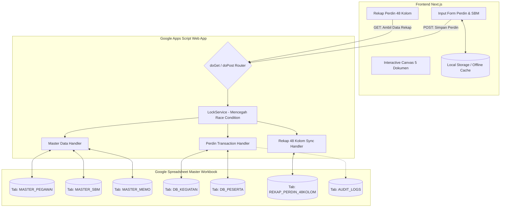

# Arsitektur & Perencanaan Database Berbasis Google Spreadsheet
## Aplikasi Kalkulator Keuangan, SPPD & Rekap Perdin Inspektorat
### Kementerian Koordinator Bidang Pangan Republik Indonesia

| Dokumen | Spesifikasi Database Google Sheets (Phase 1) |
| :--- | :--- |
| **Versi Dokumen** | 1.0.0 |
| **Status** | Blueprint Arsitektur Database Aktif (Tahap Saat Ini) |
| **Target Engine** | Google Spreadsheet (Google Workspace) + Google Apps Script (GAS Web API) |
| **Integrasi Client** | Next.js Client App (Fetch API / Local Caching / Live Sync) |
| **Migrasi Lanjutan** | SQL Skema Relasional terdokumentasi di [`docs/DATABASE_SCHEMA.md`](DATABASE_SCHEMA.md) |

---

## 1. Pendahuluan & Filosofi Arsitektur

Menggunakan **Google Spreadsheet** sebagai basis data (*Headless Spreadsheet Database*) merupakan keputusan yang sangat tepat dan efisien untuk kebutuhan operasional saat ini dengan pertimbangan:

1. **Zero Hosting & Zero Infrastructure Cost**: Tidak membutuhkan server database terpisah, pemeliharaan backup, ataupun biaya langganan cloud SQL.
2. **Kolaborasi Langsung Tim Inspektorat**: Verifikator, Bendahara, dan PPK dapat langsung membuka spreadsheet untuk melihat, memverifikasi, maupun memfilter data tanpa harus membuka aplikasi jika sedang audit lapangan.
3. **Familiaritas Format & Ekspor Excel**: Google Spreadsheet secara natif mendukung rumus-rumus akuntansi, pivot table, dan ekspor instan ke `.xlsx` atau `.pdf`.
4. **Keamanan & Audit Trail Bawaan Google Workspace**: Google Drive mencatat *Version History* secara mendetail (siapa yang mengubah baris apa, pada jam berapa).
5. **Transisi Mulus ke SQL**: Struktur kolom pada setiap sheet dirancang **100% identik** dengan skema tabel SQL di `DATABASE_SCHEMA.md`, sehingga ketika trafik meningkat dan sistem beralih ke PostgreSQL/Supabase, tidak perlu melakukan restrukturisasi data.



---

## 2. Struktur Workbook & Kamus Tab Google Sheets

Satu Google Spreadsheet Workbook bertindak sebagai database terpusat dengan 7 tab lembar kerja (*worksheets*) berikut:

| No | Nama Tab Sheet | Warna Tab Rekomendasi | Fungsi & Peran Data |
| :---: | :--- | :---: | :--- |
| **1** | `MASTER_PEGAWAI` | 🔵 Biru | Database seluruh pejabat, auditor, dan staf Inspektorat |
| **2** | `MASTER_SBM` | 🟢 Hijau | Database tarif SBM PMK per provinsi (UH, Hotel, Transport) |
| **3** | `MASTER_MEMO` | 🟣 Ungu | Register nomor memorandum resmi format `M.xxx/INS/PPK/VIII/2026` |
| **4** | `DB_KEGIATAN` | 🟡 Kuning | Data transaksi Header kegiatan dinas (ID, Nama Kegiatan, ST, PPK) |
| **5** | `DB_PESERTA` | 🟠 Oranye | Rincian pelaksana per baris (Kalkulasi Biaya, Tiket, Hotel, Riil) |
| **6** | `REKAP_PERDIN_48KOLOM` | 🔴 Merah Tua | Database flat 48 kolom akuntansi pertanggungjawaban dinas |
| **7** | `AUDIT_LOGS` | ⚪ Abu-abu | Catatan riwayat aksi (Waktu simpan, user, aksi, ID kegiatan) |

---

## 3. Spesifikasi Detail Kolom Tiap Tab (Data Schema)

### 3.1 Tab: `MASTER_PEGAWAI`
Berisi referensi pegawai aktif dan pejabat penandatangan.

| Kolom | Nama Header | Tipe Data Google Sheets | Contoh Data | Keterangan |
| :---: | :--- | :--- | :--- | :--- |
| **A** | `id_pegawai` | Plain Text | `PEG-001` | ID Unik Pegawai |
| **B** | `kode_nama` | Plain Text | `ARIF` | Kode panggilan singkat |
| **C** | `no_urut` | Number | `1` | Nomor urut baku daftar pegawai |
| **D** | `nama_lengkap` | Plain Text | `Dr. Arif Budiman, S.E., M.Si.` | Nama lengkap beserta gelar |
| **E** | `nip` | Plain Text (Formated: `@`) | `'198005122005011002` | NIP 18 Digit resmi |
| **F** | `jenis_kelamin` | Plain Text | `Laki-laki` | `Laki-laki` / `Perempuan` |
| **G** | `pangkat` | Plain Text | `Pembina Tingkat I` | Pangkat ASN |
| **H** | `golongan` | Plain Text | `IV/b` | Golongan ruang |
| **I** | `jabatan` | Plain Text | `Inspektur Wilayah I` | Jabatan struktural / fungsional |
| **J** | `kelas_jabatan` | Plain Text | `14` | Kelas jabatan |
| **K** | `nama_bank` | Plain Text | `Bank Mandiri` | Bank payroll |
| **L** | `nomor_rekening`| Plain Text (Formated: `@`) | `'1230009876543` | Nomor rekening |
| **M** | `is_active` | Plain Text (BOOLEAN) | `TRUE` | `TRUE` / `FALSE` |
| **N** | `updated_at` | Date Time | `2026-09-05 08:30:00` | Terakhir diperbarui |

---

### 3.2 Tab: `MASTER_SBM`
Berisi Standar Biaya Masukan PMK per provinsi.

| Kolom | Nama Header | Tipe Data | Contoh Data | Keterangan |
| :---: | :--- | :--- | :--- | :--- |
| **A** | `tahun_anggaran` | Number | `2026` | Tahun Anggaran berlaku |
| **B** | `nama_provinsi` | Plain Text | `JAWA BARAT` | Nama Provinsi (UPPERCASE) |
| **C** | `uh_biasa` | Currency (IDR) | `Rp 430.000` | Uang Harian Luar Kota 100% |
| **D** | `uh_halfday` | Currency (IDR) | `Rp 130.000` | Uang Saku Paket Halfday/Fullday |
| **E** | `uh_fullboard` | Currency (IDR) | `Rp 150.000` | Uang Saku Paket Fullboard |
| **F** | `hotel_eselon1` | Currency (IDR) | `Rp 5.720.000` | Batas Hotel Eselon I |
| **G** | `hotel_eselon2` | Currency (IDR) | `Rp 2.064.000` | Batas Hotel Eselon II |
| **H** | `hotel_eselon3_gol4` | Currency (IDR) | `Rp 1.006.000` | Batas Hotel Eselon III / Gol. IV |
| **I** | `hotel_eselon4_kebawah` | Currency (IDR) | `Rp 570.000` | Batas Hotel Eselon IV / Gol. III/II |
| **J** | `representatif_luar_kota` | Currency (IDR) | `Rp 200.000` | Uang Representatif Pejabat/hari |
| **K** | `taksi_bandara` | Currency (IDR) | `Rp 256.000` | Standar taksi bandara |

---

### 3.3 Tab: `MASTER_MEMO`
Register penomoran memorandum dinas pengajuan biaya.

| Kolom | Nama Header | Tipe Data | Contoh Data | Keterangan |
| :---: | :--- | :--- | :--- | :--- |
| **A** | `tahun_anggaran` | Number | `2026` | Tahun berjalan |
| **B** | `nomor_urut` | Number | `269` | Nomor urut angka |
| **C** | `format_lengkap` | Plain Text | `M.269/INS/PPK/VIII/2026` | Nomor Memorandum resmi |
| **D** | `tanggal_memo` | Date (YYYY-MM-DD) | `2026-08-25` | Tanggal pembuatan nota dinas |
| **E** | `perihal` | Plain Text | `Pengawasan Ketahanan Pangan Kab. Bandung` | Perihal dinas |
| **F** | `id_kegiatan_ref`| Plain Text | `KGT-20260825-001` | Terhubung ke transaksi kegiatan |
| **G** | `status` | Plain Text | `TERPAKAI` | `TERPAKAI` / `DIBATALKAN` / `DRAFT` |

---

### 3.4 Tab: `DB_KEGIATAN` (Header Transaksi)
Menyimpan ringkasan data paket perjalanan dinas.

| Kolom | Nama Header | Tipe Data | Contoh Data | Keterangan |
| :---: | :--- | :--- | :--- | :--- |
| **A** | `id_kegiatan` | Plain Text (PK) | `KGT-20260905-001` | ID Unik Kegiatan |
| **B** | `kode_kegiatan` | Plain Text | `PRD-BDG-01` | Kode kegiatan manual/sistem |
| **C** | `nama_kegiatan` | Plain Text | `Koordinasi Pengawasan Pasokan Beras` | Uraian kegiatan dinas |
| **D** | `jenis_pengajuan` | Plain Text | `RAMPUNG` | `RENCANA` / `RAMPUNG` / `MERAMPUNGKAN` |
| **E** | `no_spm` | Plain Text | `00073T` | Nomor SPM |
| **F** | `no_spby` | Plain Text | `0012/SPBY/INS/2026` | Nomor SPBY |
| **G** | `jenis_perdin` | Plain Text | `Perdin Luar Kota` | `Perdin Jabodetabekdung` / `Luar Kota` / `LN` |
| **H** | `berangkat_dari` | Plain Text | `Jakarta` | Kota asal |
| **I** | `provinsi_tujuan` | Plain Text | `JAWA BARAT` | Provinsi tujuan |
| **J** | `kota_tujuan_list` | Plain Text (JSON) | `["Kota Bandung", "Kab. Bandung Barat"]` | List kota tujuan |
| **K** | `tanggal_mulai` | Date (YYYY-MM-DD) | `2026-09-08` | Tgl mulai kegiatan |
| **L** | `tanggal_selesai` | Date (YYYY-MM-DD) | `2026-09-10` | Tgl selesai kegiatan |
| **M** | `alat_angkut` | Plain Text | `Angkutan Darat` | Alat angkutan transportasi |
| **N** | `nomor_st_master` | Plain Text | `ST.088/INS/KP/09/2026` | Nomor ST Induk |
| **O** | `nomor_st_staf` | Plain Text | `ST.088/INS/KP/09/2026` | Nomor ST Staf |
| **P** | `nomor_st_pejabat` | Plain Text | `ST.089/INS/KP/09/2026` | Nomor ST Pejabat (jika beda) |
| **Q** | `use_different_st_pejabat` | Plain Text (BOOLEAN) | `FALSE` | Status ST terpisah |
| **R** | `nomor_memo` | Plain Text | `M.269/INS/PPK/VIII/2026` | Nomor Memorandum |
| **S** | `tanggal_memo` | Date (YYYY-MM-DD) | `2026-08-25` | Tanggal Memorandum |
| **T** | `tanggal_spd` | Date (YYYY-MM-DD) | `2026-09-05` | Tanggal SPD |
| **U** | `kode_mak` | Plain Text | `524111` | Kode Akun MAK APBN |
| **V** | `kode_komponen` | Plain Text | `051` | Sub Kegiatan / Komponen |
| **W** | `item_detail` | Plain Text | `001` | Detail belanja |
| **X** | `unit_kerja` | Plain Text | `INSPEKTORAT` | Unit pemilik anggaran |
| **Y** | `ppk_nama` | Plain Text | `Ahmad Rivai, S.E., M.M.` | Nama PPK |
| **Z** | `ppk_nip` | Plain Text (Formated) | `'197801012003121001` | NIP PPK |
| **AA** | `bendahara_nama` | Plain Text | `Siti Rahmah, A.Md.` | Nama Bendahara Pengeluaran |
| **AB** | `verifikator_nama`| Plain Text | `Budi Santoso` | Petugas Verifikator |
| **AC** | `grand_total` | Currency (IDR) | `Rp 14.580.000` | Total Biaya Seluruh Peserta |
| **AD** | `status_dokumen` | Plain Text | `FINAL` | `DRAFT` / `FINAL` / `SPJ_RAMPUNG` |
| **AE** | `created_at` | Date Time | `2026-09-05 16:00:00` | Waktu simpan |

---

### 3.5 Tab: `DB_PESERTA` (Detail Pelaksana & Komponen Biaya)
Menyimpan baris peserta dan seluruh komponen rincian (termasuk data tiket, hotel, riil, dan SPJ extra).

| Kolom | Nama Header | Tipe Data | Contoh Data | Keterangan |
| :---: | :--- | :--- | :--- | :--- |
| **A** | `id_peserta` | Plain Text (PK) | `PST-20260905-001-01` | ID Unik Peserta |
| **B** | `id_kegiatan` | Plain Text (FK) | `KGT-20260905-001` | ID Kegiatan Induk |
| **C** | `id_pegawai` | Plain Text (FK) | `PEG-001` | ID Master Pegawai |
| **D** | `urutan` | Number | `1` | Nomor urut peserta |
| **E** | `nomor_spd` | Plain Text | `01` | Lembar nomor SPD |
| **F** | `nomor_st_assigned`| Plain Text | `ST.088/INS/KP/09/2026` | Nomor ST berlaku untuk peserta |
| **G** | `is_pejabat` | Plain Text (BOOLEAN) | `FALSE` | Status Pejabat/Pimpinan |
| **H** | `nama_snapshot` | Plain Text | `Dr. Arif Budiman, S.E., M.Si.` | **Snapshot Nama saat dinas** |
| **I** | `nip_snapshot` | Plain Text | `'198005122005011002` | **Snapshot NIP saat dinas** |
| **J** | `golongan_snapshot`| Plain Text | `IV/b` | **Snapshot Golongan saat dinas** |
| **K** | `jabatan_snapshot` | Plain Text | `Auditor Madya` | **Snapshot Jabatan saat dinas** |
| **L** | `tujuan_kota` | Plain Text | `Kota Bandung` | Kota tujuan spesifik |
| **M** | `tanggal_mulai` | Date | `2026-09-08` | Tanggal mulai dinas |
| **N** | `tanggal_selesai` | Date | `2026-09-10` | Tanggal kembali |
| **O** | `lama_hari` | Number | `3` | Total hari dinas |
| **P** | `hari_uh_biasa` | Number | `3` | Hari UH 100% |
| **Q** | `biaya_uh_biasa` | Currency | `Rp 1.290.000` | Total UH 100% |
| **R** | `hari_uh_60` | Number | `0` | Hari UH 60% |
| **S** | `biaya_uh_60` | Currency | `Rp 0` | Total UH 60% |
| **T** | `hari_uh_halfday` | Number | `0` | Hari UH Halfday |
| **U** | `biaya_uh_halfday` | Currency | `Rp 0` | Total UH Halfday |
| **V** | `hari_uh_fullboard`| Number | `0` | Hari UH Fullboard |
| **W** | `biaya_uh_fullboard`| Currency | `Rp 0` | Total UH Fullboard |
| **X** | `biaya_tiket` | Currency | `Rp 2.450.000` | Total Biaya Tiket |
| **Y** | `biaya_hotel` | Currency | `Rp 1.800.000` | Total Biaya Hotel Riil |
| **Z** | `biaya_penginapan_30`| Currency | `Rp 0` | Penginapan 30% SBM |
| **AA** | `biaya_trans_darat` | Currency | `Rp 350.000` | Transportasi Darat PP |
| **AB** | `biaya_trans_lokal` | Currency | `Rp 150.000` | Transportasi Lokal |
| **AC** | `biaya_trans_jakarta_pp`| Currency | `Rp 250.000` | Transportasi Jakarta PP |
| **AD** | `biaya_trans_daerah_pp` | Currency | `Rp 200.000` | Transportasi Daerah PP |
| **AE** | `biaya_riil` | Currency | `Rp 100.000` | Pengeluaran Riil |
| **AF** | `biaya_meeting` | Currency | `Rp 0` | Paket Rapat |
| **AG** | `biaya_representatif`| Currency | `Rp 0` | Uang Representatif Pejabat |
| **AH** | `total_biaya` | Currency | `Rp 6.590.000` | **Total Hak Bayar Peserta** |
| **AI** | `tiket_boarding_pass`| Plain Text | `ADA` | Status Boarding Pass (`ADA`/`TIDAK`) |
| **AJ** | `tiket_pergi_no` | Plain Text | `126-987654321` | No Tiket Pergi |
| **AK** | `tiket_pergi_booking` | Plain Text | `CEWDYV` | Kode Booking Pergi |
| **AL** | `tiket_pergi_maskapai`| Plain Text | `Garuda Indonesia` | Maskapai Pergi |
| **AM** | `tiket_pergi_fare` | Currency | `Rp 1.250.000` | Tarif Fare Pergi |
| **AN** | `tiket_pulang_no` | Plain Text | `126-987654322` | No Tiket Pulang |
| **AO** | `tiket_pulang_booking`| Plain Text | `FENZC9` | Kode Booking Pulang |
| **AP** | `tiket_pulang_maskapai`| Plain Text | `Garuda Indonesia` | Maskapai Pulang |
| **AQ** | `tiket_pulang_fare` | Currency | `Rp 1.200.000` | Tarif Fare Pulang |
| **AR** | `hotel_nama` | Plain Text | `Hotel Savoy Homann` | Nama Penginapan |
| **AS** | `hotel_checkin` | Date | `2026-09-08` | Tanggal Check-in Hotel |
| **AT** | `hotel_checkout` | Date | `2026-09-10` | Tanggal Check-out Hotel |
| **AU** | `hotel_malam` | Number | `2` | Jumlah malam menginap |
| **AV** | `hotel_bill_folio` | Plain Text | `INV-2026-8871` | Nomor Invoice / Folio Bill |
| **AW** | `hotel_no_kamar` | Plain Text | `304` | Nomor Kamar |
| **AX** | `riil_items_json` | Plain Text (JSON) | `[{"uraian":"Taksi","amount":100000}]` | Detail Item Riil |
| **AY** | `spj_nama_external` | Plain Text | `Drs. H. Mulyono` | Nama Pelaksana Eksternal |
| **AZ** | `spj_sewa_kendaraan` | Currency | `Rp 0` | Sewa Kendaraan Ekstra |
| **BA** | `spj_taksi_bandara` | Currency | `Rp 0` | Taksi Bandara Ekstra |
| **BB** | `spj_biaya_reschedule`| Currency | `Rp 0` | Biaya Penyesuaian Tiket |
| **BC** | `spj_kurs_valuta` | Currency | `Rp 0` | Kurs Mata Uang Asing |
| **BD** | `spj_pengembalian_kas`| Currency | `Rp 0` | Pengembalian Kas Negara |

---

### 3.6 Tab: `REKAP_PERDIN_48KOLOM`
Tab ini menampung 48 kolom resmi pelaporan pertanggungjawaban dinas yang diselaraskan dengan template Excel Inspektorat:

```
[A] No SPBY
[B] JENIS PENGAJUAN (dropdown: RENCANA, RAMPUNG, MERAMPUNGKAN)
[C] No SPM
[D] (Divider / Kosong)
[E] NAMA PEGAWAI INTERNAL INSPEKTORAT
[F] NAMA EXTERNAL
[G] NIP
[H] Gol
[I] Jabatan
[J] Jenis Perdin
[K] Status Pegawai (PNS / Non-PNS)
[L] Nama Kegiatan
[M] No Surat Tugas
[N] Unit Kerja
[O] Angkutan
[P] Berangkat dari-
[Q] Tujuan ke-
[R] Tgl Berangkat
[S] Tgl Kembali
[T] Nomor Tiket
[U] Nama Maskapai
[V] Kode Booking
[W] Boarding Pass (Ada/Tidak)
[X] Nama Penginapan
[Y] Tanggal Check In
[Z] Tanggal Check Out
[AA] Jumlah Hari Menginap
[AB] Lama Hari 100%
[AC] Lama Hari 40%
[AD] Total Hari
[AE] UH 100% ()
[AF] UH 40% ()
[AG] UH Fullboard/Fullday/Halfday/Diklat
[AH] Biaya Penginapan Biasa (Hotel)
[AI] Penginapan 30%
[AJ] Biaya Fullboard/Fullday/Halfday ()
[AK] Kurs ()
[AL] Riil ()
[AM] Harga Fare Tiket Pergi ()
[AN] Harga FareTiket Pulang ()
[AO] Transport Jakarta PP
[AP] Transport Daerah PP
[AQ] Biaya Transport ()
[AR] Sewa kendaraan ()
[AS] Representatif ()
[AT] Taksi Bandara
[AU] Biaya Reschedule ()
[AV] Total
[AW] Nilai Nominal di Daftar Nominatif
[AX] PENGEMBALIAN
```

---

## 4. Script Backend Google Apps Script (`Code.gs`)

Berikut adalah kode backend **Google Apps Script** yang dipasang pada menu *Extensions > Apps Script* di Google Spreadsheet dan di-deploy sebagai **Web App** (*Execute as: Me*, *Who has access: Anyone*):

```javascript
/**
 * BACKEND API GOOGLE APPS SCRIPT (v1.2 - Self-Healing Database Engine)
 * Aplikasi Kalkulator Keuangan & SPPD Inspektorat
 * Kemenko Bidang Pangan RI
 */

// OPTIONAL: Isi ID Spreadsheet jika menggunakan Standalone Script.
// Kosongkan ('') jika skrip dibuat langsung dari menu Ekstensi > Apps Script di Spreadsheet.
const SPREADSHEET_ID = '';

const SHEET_NAMES = {
  PEGAWAI: 'MASTER_PEGAWAI',
  SBM: 'MASTER_SBM',
  MEMO: 'MASTER_MEMO',
  KEGIATAN: 'DB_KEGIATAN',
  PESERTA: 'DB_PESERTA',
  REKAP: 'REKAP_PERDIN_48KOLOM',
  LOGS: 'AUDIT_LOGS'
};

const DEFAULT_HEADERS = {
  PEGAWAI: [
    'id_pegawai', 'kode_nama', 'no_urut', 'nama_lengkap', 'nip', 'jenis_kelamin',
    'pangkat', 'golongan', 'jabatan', 'kelas_jabatan', 'nama_bank', 'nomor_rekening',
    'is_active', 'updated_at'
  ],
  SBM: [
    'tahun_anggaran', 'nama_provinsi', 'uh_biasa', 'uh_halfday', 'uh_fullboard',
    'hotel_eselon1', 'hotel_eselon2', 'hotel_eselon3_gol4', 'hotel_eselon4_kebawah',
    'representatif_luar_kota', 'taksi_bandara'
  ],
  MEMO: [
    'tahun_anggaran', 'nomor_urut', 'format_lengkap', 'tanggal_memo', 'perihal',
    'id_kegiatan_ref', 'status'
  ],
  KEGIATAN: [
    'id_kegiatan', 'kode_kegiatan', 'nama_kegiatan', 'jenis_pengajuan', 'no_spm', 'no_spby',
    'jenis_perdin', 'berangkat_dari', 'provinsi_tujuan', 'kota_tujuan_list', 'tanggal_mulai',
    'tanggal_selesai', 'alat_angkut', 'nomor_st_master', 'nomor_st_staf', 'nomor_st_pejabat',
    'use_different_st_pejabat', 'nomor_memo', 'tanggal_memo', 'tanggal_spd', 'kode_mak',
    'kode_komponen', 'item_detail', 'unit_kerja', 'ppk_nama', 'ppk_nip', 'bendahara_nama',
    'verifikator_nama', 'grand_total', 'status_dokumen', 'created_at'
  ],
  PESERTA: [
    'id_peserta', 'id_kegiatan', 'id_pegawai', 'urutan', 'nomor_spd', 'nomor_st_assigned',
    'is_pejabat', 'nama_snapshot', 'nip_snapshot', 'golongan_snapshot', 'jabatan_snapshot',
    'tujuan_kota', 'tanggal_mulai', 'tanggal_selesai', 'lama_hari', 'hari_uh_biasa', 'biaya_uh_biasa',
    'hari_uh_60', 'biaya_uh_60', 'hari_uh_halfday', 'biaya_uh_halfday', 'hari_uh_fullboard',
    'biaya_uh_fullboard', 'biaya_tiket', 'biaya_hotel', 'biaya_penginapan_30', 'biaya_trans_darat',
    'biaya_trans_lokal', 'biaya_trans_jakarta_pp', 'biaya_trans_daerah_pp', 'biaya_riil',
    'biaya_meeting', 'biaya_representatif', 'total_biaya', 'tiket_boarding_pass', 'tiket_pergi_no',
    'tiket_pergi_booking', 'tiket_pergi_maskapai', 'tiket_pergi_fare', 'tiket_pulang_no',
    'tiket_pulang_booking', 'tiket_pulang_maskapai', 'tiket_pulang_fare', 'hotel_nama',
    'hotel_checkin', 'hotel_checkout', 'hotel_malam', 'hotel_bill_folio', 'hotel_no_kamar',
    'riil_items_json', 'spj_nama_external', 'spj_sewa_kendaraan', 'spj_taksi_bandara',
    'spj_biaya_reschedule', 'spj_kurs_valuta', 'spj_pengembalian_kas'
  ],
  REKAP: [
    'No SPBY', 'JENIS PENGAJUAN', 'No SPM', '', 'NAMA PEGAWAI INTERNAL INSPEKTORAT', 'NAMA EXTERNAL',
    'NIP', 'Gol', 'Jabatan', 'Jenis Perdin', 'Status Pegawai', 'Nama Kegiatan', 'No Surat Tugas',
    'Unit Kerja', 'Angkutan', 'Berangkat dari-', 'Tujuan ke-', 'Tgl Berangkat', 'Tgl Kembali',
    'Nomor Tiket', 'Nama Maskapai', 'Kode Booking', 'Boarding Pass (Ada/Tidak)', 'Nama Penginapan',
    'Tanggal Check In', 'Tanggal Check Out', 'Jumlah Hari Menginap', 'Lama Hari 100%', 'Lama Hari 40%',
    'Total Hari', 'UH 100% ()', 'UH 40% ()', 'UH Fullboard/Fullday/Halfday/Diklat',
    'Biaya Penginapan Biasa (Hotel)', 'Penginapan 30%', 'Biaya Fullboard/Fullday/Halfday ()',
    'Kurs ()', 'Riil ()', 'Harga Fare Tiket Pergi ()', 'Harga FareTiket Pulang ()',
    'Transport Jakarta PP', 'Transport Daerah PP', 'Biaya Transport ()', 'Sewa kendaraan ()',
    'Representatif ()', 'Taksi Bandara', 'Biaya Reschedule ()', 'Total',
    'Nilai Nominal di Daftar Nominatif', 'PENGEMBALIAN'
  ]
};

/**
 * FUNGSI SETUP OTOMATIS (Jalankan ini sekali via tombol Run di Apps Script jika ingin inisialisasi instan)
 */
function SETUP_INITIAL_TABS() {
  const ss = getSpreadsheet();
  getOrCreateSheet(ss, SHEET_NAMES.PEGAWAI, DEFAULT_HEADERS.PEGAWAI);
  getOrCreateSheet(ss, SHEET_NAMES.SBM, DEFAULT_HEADERS.SBM);
  getOrCreateSheet(ss, SHEET_NAMES.MEMO, DEFAULT_HEADERS.MEMO);
  getOrCreateSheet(ss, SHEET_NAMES.KEGIATAN, DEFAULT_HEADERS.KEGIATAN);
  getOrCreateSheet(ss, SHEET_NAMES.PESERTA, DEFAULT_HEADERS.PESERTA);
  getOrCreateSheet(ss, SHEET_NAMES.REKAP, DEFAULT_HEADERS.REKAP);
  getOrCreateSheet(ss, SHEET_NAMES.LOGS, ['Timestamp', 'Action', 'Reference_ID', 'Details']);
  Logger.log('✅ Inisialisasi 7 tab lembar kerja berhasil!');
}

function getSpreadsheet() {
  if (SPREADSHEET_ID && SPREADSHEET_ID.trim() !== '') {
    return SpreadsheetApp.openById(SPREADSHEET_ID.trim());
  }
  return SpreadsheetApp.getActiveSpreadsheet() || SpreadsheetApp.getActive();
}

/**
 * Handle HTTP GET Request
 */
function doGet(e) {
  const action = (e && e.parameter && e.parameter.action) || 'GET_MASTERS';
  const ss = getSpreadsheet();

  try {
    if (action === 'GET_MASTERS') {
      const pegawaiSheet = getOrCreateSheet(ss, SHEET_NAMES.PEGAWAI, DEFAULT_HEADERS.PEGAWAI);
      const sbmSheet = getOrCreateSheet(ss, SHEET_NAMES.SBM, DEFAULT_HEADERS.SBM);
      const memoSheet = getOrCreateSheet(ss, SHEET_NAMES.MEMO, DEFAULT_HEADERS.MEMO);

      return createJsonResponse({
        status: 'success',
        data: {
          pegawai: sheetToObjects(pegawaiSheet),
          sbm: sheetToObjects(sbmSheet),
          memo: sheetToObjects(memoSheet)
        }
      });
    }

    if (action === 'GET_REKAP') {
      const rekapSheet = getOrCreateSheet(ss, SHEET_NAMES.REKAP, DEFAULT_HEADERS.REKAP);
      return createJsonResponse({
        status: 'success',
        data: sheetToObjects(rekapSheet)
      });
    }

    if (action === 'GET_KEGIATAN_LIST') {
      const kegiatanSheet = getOrCreateSheet(ss, SHEET_NAMES.KEGIATAN, DEFAULT_HEADERS.KEGIATAN);
      return createJsonResponse({
        status: 'success',
        data: sheetToObjects(kegiatanSheet)
      });
    }

    return createJsonResponse({ status: 'error', message: 'Action not found' });
  } catch (error) {
    return createJsonResponse({ status: 'error', message: error.toString() });
  }
}

/**
 * Handle HTTP POST Request (Simpan / Update Transaksi Perdin)
 */
function doPost(e) {
  const lock = LockService.getScriptLock();
  lock.tryLock(30000);

  try {
    const payload = JSON.parse(e.postData.contents);
    const action = payload.action;
    const ss = getSpreadsheet();

    if (action === 'SAVE_PERDIN') {
      const header = payload.header || {};
      const participants = payload.participants || [];

      // 1. Simpan/Update DB_KEGIATAN
      const kegiatanSheet = getOrCreateSheet(ss, SHEET_NAMES.KEGIATAN, DEFAULT_HEADERS.KEGIATAN);
      upsertRowById(kegiatanSheet, 'id_kegiatan', header.idKegiatan, [
        header.idKegiatan,
        header.kodeKegiatan || '',
        header.namaKegiatan || '',
        header.jenisPengajuan || 'RAMPUNG',
        header.noSpm || '',
        header.noSpby || '',
        header.jenisPerdin || 'Perdin Luar Kota',
        header.berangkatDari || 'Jakarta',
        header.provinsiTujuan || '',
        JSON.stringify(header.kotaTujuanList || []),
        header.tanggalMulai || '',
        header.tanggalSelesai || '',
        header.alatAngkut || 'Angkutan Darat',
        header.nomorStMaster || '',
        header.nomorStStaff || '',
        header.nomorStPejabat || '',
        header.useDifferentStPejabat || false,
        header.nomorMemo || '',
        header.tanggalMemo || '',
        header.tanggalSpd || '',
        header.kodeMak || '524111',
        header.kodeKomponen || '051',
        header.itemDetail || '001',
        header.unitKerja || 'INSPEKTORAT',
        header.ppkNama || '',
        header.ppkNip || '',
        header.bendaharaNama || '',
        header.verifikatorNama || '',
        header.grandTotal || 0,
        header.statusDokumen || 'FINAL',
        new Date()
      ]);

      // 2. Simpan Detail DB_PESERTA & REKAP 48 Kolom
      const pesertaSheet = getOrCreateSheet(ss, SHEET_NAMES.PESERTA, DEFAULT_HEADERS.PESERTA);
      const rekapSheet = getOrCreateSheet(ss, SHEET_NAMES.REKAP, DEFAULT_HEADERS.REKAP);

      // Bersihkan baris lama kegiatan ini
      deleteRowsByColumnValue(pesertaSheet, 'id_kegiatan', header.idKegiatan);
      deleteRowsByColumnValue(rekapSheet, 'Nama Kegiatan', header.namaKegiatan);

      participants.forEach((p, idx) => {
        const idPeserta = header.idKegiatan + '-' + (idx + 1).toString().padStart(2, '0');

        // Baris untuk DB_PESERTA
        pesertaSheet.appendRow([
          idPeserta,
          header.idKegiatan,
          p.pegawaiId || '',
          idx + 1,
          p.nomorSpd || '',
          p.nomorStAssigned || header.nomorStStaff || '',
          p.isPejabat || false,
          p.nama || '',
          p.nip || '',
          p.golongan || '',
          p.jabatan || '',
          p.tujuanKota || '',
          p.tanggalMulai || '',
          p.tanggalSelesai || '',
          p.lamaHari || 0,
          p.hariUhBiasa || 0,
          p.biayaUhBiasa || 0,
          p.hariUh60 || 0,
          p.biayaUh60 || 0,
          p.hariUhHalfday || 0,
          p.biayaUhHalfday || 0,
          p.hariUhFullboard || 0,
          p.biayaUhFullboard || 0,
          p.biayaTiket || 0,
          p.biayaHotel || 0,
          p.biayaPenginapan30 || 0,
          p.biayaTransDarat || 0,
          p.biayaTransLokal || 0,
          p.biayaTransJakartaPp || 0,
          p.biayaTransDaerahPp || 0,
          p.biayaRiil || 0,
          p.biayaMeeting || 0,
          p.biayaRepresentatif || 0,
          p.totalBiaya || 0,
          p.ticketDetail?.boardingPassStatus || '',
          p.ticketDetail?.pergiNoTiket || '',
          p.ticketDetail?.pergiKodeBooking || '',
          p.ticketDetail?.pergiMaskapai || '',
          p.ticketDetail?.pergiHargaFare || 0,
          p.ticketDetail?.pulangNoTiket || '',
          p.ticketDetail?.pulangKodeBooking || '',
          p.ticketDetail?.pulangMaskapai || '',
          p.ticketDetail?.pulangHargaFare || 0,
          p.hotelDetail?.namaHotel || '',
          p.hotelDetail?.tanggalCheckin || '',
          p.hotelDetail?.tanggalCheckout || '',
          p.hotelDetail?.jumlahMalam || 1,
          p.hotelDetail?.noBillFolio || '',
          p.hotelDetail?.noKamar || '',
          JSON.stringify(p.riilItems || []),
          p.spjExtra?.namaExternal || '',
          p.spjExtra?.sewaKendaraan || 0,
          p.spjExtra?.taksiBandara || 0,
          p.spjExtra?.biayaReschedule || 0,
          p.spjExtra?.kursValuta || 0,
          p.spjExtra?.pengembalianKas || 0
        ]);

        // Baris untuk REKAP_PERDIN_48KOLOM
        rekapSheet.appendRow([
          header.noSpby || '',
          header.jenisPengajuan || 'RAMPUNG',
          header.noSpm || '',
          '',
          p.spjExtra?.namaExternal ? '' : p.nama,
          p.spjExtra?.namaExternal || '',
          p.nip || '',
          p.golongan || '',
          p.jabatan || '',
          header.jenisPerdin || 'Perdin Luar Kota',
          p.nip ? 'PNS' : 'Non-PNS',
          header.namaKegiatan || '',
          p.nomorStAssigned || header.nomorStStaff || '',
          header.unitKerja || 'INSPEKTORAT',
          header.alatAngkut || 'Angkutan Darat',
          header.berangkatDari || 'Jakarta',
          p.tujuanKota || '',
          p.tanggalMulai || '',
          p.tanggalSelesai || '',
          formatMultiTiket(p.ticketDetail?.pergiNoTiket, p.ticketDetail?.pulangNoTiket),
          formatMultiTiket(p.ticketDetail?.pergiMaskapai, p.ticketDetail?.pulangMaskapai),
          formatMultiTiket(p.ticketDetail?.pergiKodeBooking, p.ticketDetail?.pulangKodeBooking),
          p.ticketDetail?.boardingPassStatus || (p.biayaTiket > 0 ? 'ADA' : ''),
          p.hotelDetail?.namaHotel || '',
          p.hotelDetail?.tanggalCheckin || p.tanggalMulai,
          p.hotelDetail?.tanggalCheckout || p.tanggalSelesai,
          p.hotelDetail?.jumlahMalam || 1,
          p.hariUhBiasa || 0,
          p.hariUh60 || 0,
          p.lamaHari || 0,
          p.biayaUhBiasa || 0,
          p.biayaUh60 || 0,
          (p.biayaUhHalfday || 0) + (p.biayaUhFullboard || 0),
          p.biayaHotel || 0,
          p.biayaPenginapan30 || 0,
          p.biayaMeeting || 0,
          p.spjExtra?.kursValuta || 0,
          p.biayaRiil || 0,
          p.ticketDetail?.pergiHargaFare || 0,
          p.ticketDetail?.pulangHargaFare || 0,
          p.biayaTransJakartaPp || 0,
          p.biayaTransDaerahPp || 0,
          (p.biayaTransDarat || 0) + (p.biayaTransLokal || 0),
          p.spjExtra?.sewaKendaraan || 0,
          p.biayaRepresentatif || 0,
          p.spjExtra?.taksiBandara || 0,
          p.spjExtra?.biayaReschedule || 0,
          p.totalBiaya || 0,
          p.totalBiaya || 0,
          p.spjExtra?.pengembalianKas || 0
        ]);
      });

      logAction(ss, 'SAVE_PERDIN', header.idKegiatan, 'Berhasil menyimpan transaksi ' + (header.namaKegiatan || ''));

      return createJsonResponse({
        status: 'success',
        message: 'Data perjalanan dinas dan 48 kolom rekap berhasil disimpan ke Google Spreadsheet.',
        idKegiatan: header.idKegiatan
      });
    }

    return createJsonResponse({ status: 'error', message: 'Unknown action' });
  } catch (error) {
    return createJsonResponse({ status: 'error', message: error.toString() });
  } finally {
    lock.releaseLock();
  }
}

/**
 * Helper: Ambil Sheet atau Buat Baru jika belum ada
 */
function getOrCreateSheet(ss, sheetName, defaultHeaders) {
  let sheet = ss.getSheetByName(sheetName);
  if (!sheet) {
    sheet = ss.insertSheet(sheetName);
    if (defaultHeaders && defaultHeaders.length > 0) {
      sheet.appendRow(defaultHeaders);
    }
  } else if (sheet.getLastRow() === 0 && defaultHeaders && defaultHeaders.length > 0) {
    sheet.appendRow(defaultHeaders);
  }
  return sheet;
}

function createJsonResponse(data) {
  return ContentService.createTextOutput(JSON.stringify(data))
    .setMimeType(ContentService.MimeType.JSON);
}

function sheetToObjects(sheet) {
  if (!sheet) return [];
  if (sheet.getLastRow() < 2) return [];

  const data = sheet.getDataRange().getValues();
  if (data.length < 2) return [];

  const headers = data[0];
  const rows = data.slice(1);

  return rows.map(row => {
    const obj = {};
    headers.forEach((header, index) => {
      if (header) {
        obj[header] = row[index];
      }
    });
    return obj;
  });
}

function upsertRowById(sheet, keyColumnName, keyValue, rowData) {
  if (!sheet) return;
  if (sheet.getLastRow() === 0) {
    sheet.appendRow(rowData);
    return;
  }

  const data = sheet.getDataRange().getValues();
  const headers = data[0] || [];
  const keyIndex = headers.indexOf(keyColumnName);

  if (keyIndex !== -1) {
    for (let i = 1; i < data.length; i++) {
      if (data[i][keyIndex] === keyValue) {
        sheet.getRange(i + 1, 1, 1, rowData.length).setValues([rowData]);
        return;
      }
    }
  }
  sheet.appendRow(rowData);
}

function deleteRowsByColumnValue(sheet, columnName, value) {
  if (!sheet) return;
  if (sheet.getLastRow() < 2) return;

  const data = sheet.getDataRange().getValues();
  const headers = data[0] || [];
  const colIndex = headers.indexOf(columnName);
  if (colIndex === -1) return;

  for (let i = data.length - 1; i >= 1; i--) {
    if (data[i][colIndex] === value) {
      sheet.deleteRow(i + 1);
    }
  }
}

function formatMultiTiket(pergi, pulang) {
  if (!pergi && !pulang) return '';
  return 'Berangkat : ' + (pergi || '-') + '\nPulang : ' + (pulang || '-');
}

function logAction(ss, action, refId, details) {
  try {
    const logSheet = getOrCreateSheet(ss, SHEET_NAMES.LOGS, ['Timestamp', 'Action', 'Reference_ID', 'Details']);
    logSheet.appendRow([new Date(), action, refId, details]);
  } catch (e) {}
}
```

---

## 5. Integrasi Frontend Next.js (`src/lib/googleSheetsService.ts`)

Aplikasi Next.js berkomunikasi dengan Google Apps Script melalui RESTful wrapper yang dilengkapi sistem **Offline Cache** (*LocalStorage Fallback*):

```typescript
// src/lib/googleSheetsService.ts

const GAS_API_URL = process.env.NEXT_PUBLIC_GAS_API_URL || '';

export interface ApiResponse<T> {
  status: 'success' | 'error';
  data?: T;
  message?: string;
  idKegiatan?: string;
}

export async function fetchMasterDataFromSheet() {
  try {
    if (!GAS_API_URL) throw new Error('GAS API URL belum dikonfigurasi');
    const res = await fetch(`${GAS_API_URL}?action=GET_MASTERS`);
    const json: ApiResponse<any> = await res.json();
    if (json.status === 'success') {
      // Simpan di local cache
      localStorage.setItem('cached_master_data', JSON.stringify(json.data));
      return json.data;
    }
  } catch (err) {
    console.warn('Gagal fetch ke Google Sheets, menggunakan offline local data', err);
    const cached = localStorage.getItem('cached_master_data');
    if (cached) return JSON.parse(cached);
  }
  return null;
}

export async function savePerdinToGoogleSheet(header: any, participants: any[]) {
  const payload = {
    action: 'SAVE_PERDIN',
    header: {
      ...header,
      idKegiatan: header.idKegiatan || `KGT-${Date.now()}`
    },
    participants
  };

  // Simpan di LocalStorage sebagai antrean offline
  localStorage.setItem(`draft_perdin_${payload.header.idKegiatan}`, JSON.stringify(payload));

  if (!GAS_API_URL) {
    return { status: 'success', message: 'Tersimpan lokal (Mode Demo / URL belum diset)' };
  }

  const res = await fetch(GAS_API_URL, {
    method: 'POST',
    headers: { 'Content-Type': 'text/plain;charset=utf-8' }, // Format aman untuk CORS GAS
    body: JSON.stringify(payload)
  });

  return await res.json();
}
```

---

## 6. Prosedur Setup & Panduan Deploy

1. **Buat Google Spreadsheet Baru**:
   - Beri nama: `DATABASE_PERDIN_INSPEKTORAT_2026`.
   - Buat 7 tab dengan nama yang persis sama: `MASTER_PEGAWAI`, `MASTER_SBM`, `MASTER_MEMO`, `DB_KEGIATAN`, `DB_PESERTA`, `REKAP_PERDIN_48KOLOM`, `AUDIT_LOGS`.
   - Isi baris pertama (Row 1) setiap tab dengan nama header kolom yang telah dirinci pada Bab 3.

2. **Pasang Skrip Google Apps Script**:
   - Di Google Sheets, klik menu **Extensions > Apps Script** (Ekstensi > Apps Script).
   - Hapus kode bawaan, lalu tempel kode `Code.gs` dari Bab 4.
   - Klik **Deploy > New deployment** (Terapkan > Penerapan baru).
   - Pilih jenis: **Web app**.
   - **Description**: `API Perdin v1.0`.
   - **Execute as**: `Me (email@kemenko.go.id)`.
   - **Who has access**: `Anyone` (Siapa saja).
   - Klik **Deploy**, lalu salin URL Web App yang dihasilkan (`https://script.google.com/macros/s/.../exec`).

3. **Hubungkan ke Aplikasi Next.js**:
   - Buka file `.env.local` pada project, tambahkan:
     ```env
     NEXT_PUBLIC_GAS_API_URL="https://script.google.com/macros/s/AKfycbx.../exec"
     ```

---

## 7. Strategi Transisi di Masa Mendatang (Google Sheets ➔ SQL PostgreSQL)

Karena skema penamaan kolom pada Google Sheets di atas dibuat **1-to-1 mapping** dengan tabel SQL di [`DATABASE_SCHEMA.md`](DATABASE_SCHEMA.md):
- **Ekspor CSV/JSON Sekali Klik**: Data dari tab `DB_KEGIATAN` dan `DB_PESERTA` dapat langsung di-dump ke CSV dan di-import ke PostgreSQL menggunakan perintah `\copy perdin_kegiatan FROM 'kegiatan.csv' WITH CSV HEADER`.
- **Zero Schema Refactoring**: Struktur tipe TypeScript (`HeaderData`, `ParticipantRow`, `TicketDetail`, dll.) tidak perlu dirombak sama sekali saat beralih ke Prisma ORM / PostgreSQL.
