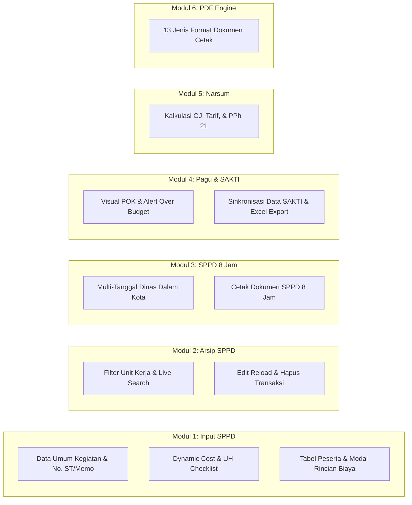
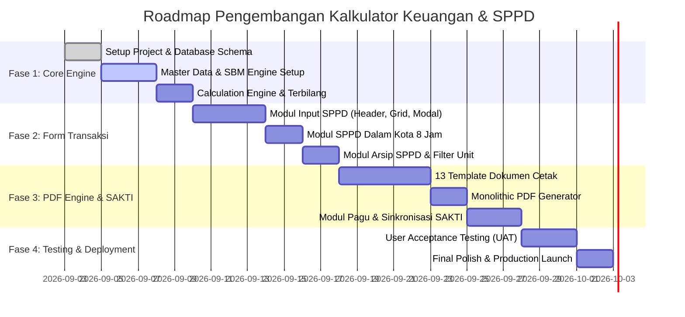

# Product Requirement Document (PRD)

## Sistem Informasi Kalkulator Keuangan & Pertanggungjawaban Perjalanan Dinas (Inspektorat)

| Attribute                     | Detail                                                                                    |
| :---------------------------- | :---------------------------------------------------------------------------------------- |
| **Nama Produk**               | **Kalkulator Keuangan & SPPD Inspektorat (Satu Sendok Web Enterprise)**                   |
| **Versi Dokumen**             | 2.0.0 (Comprehensive Enterprise Edition)                                                 |
| **Status Dokumen**            | Approved & Finalized                                                                      |
| **Instansi / Unit Target**    | Inspektorat / Kementerian Koordinator Bidang Pangan                                       |
| **Kategori Sistem**           | Web-Based Financial Calculation & Mass Official Document Generation System               |

---

## 1. Executive Summary & Visi Produk

### 1.1 Latar Belakang & Transformasi Sistem
Pengelolaan pertanggungjawaban keuangan negara untuk Perjalanan Dinas Jabatan (SPPD) dan Honorarium Narasumber di lingkungan Inspektorat sebelumnya mengandalkan spreadsheet Microsoft Excel (`Salinan dari Rekap Keuangan Inspektorat 2026.xlsx`) serta prototipe Google Apps Script (*Satu Sendok*). 

Meskipun telah memberikan efisiensi awal, ketergantungan pada Google Apps Script dan spreadsheet memiliki batasan struktural:
1. **Batas Eksekusi & Kuota Google**: Keterbatasan runtime 6 menit, kuota email/PDF Google Workspace, serta latensi cold-start.
2. **Ketiadaan Role-Based Access Control (RBAC)**: Tidak adanya pemisahan hak akses antara Operator, Verifikator, Bendahara, dan PPK secara granular.
3. **Integritas Relasional Data**: Spreadsheet rawan modifikasi sel yang tidak sengaja, formula terhapus, serta ketiadaan *audit trail* transaksi.

### 1.2 Tujuan Produk (Product Goals)
Membangun **Sistem Web Enterprise Mandiri (*Standalone Web Application*)** yang menyatukan seluruh alur administrasi keuangan perjalanan dinas:
* **Kalkulasi SBM Otomatis & Presisi**: Perhitungan tarif Uang Harian, Hotel, Transportasi, dan Honorarium Narasumber sesuai Standar Biaya Masukan (SBM) PMK Kemenkeu terkini.
* **Generator Massal 13 Format Dokumen Cetak Resmi**: Sekali klik untuk menghasilkan seluruh berkas pertanggungjawaban lengkap (*PDF Bundle*) maupun per dokumen (*Memorandum V2, Nominatif, Kwitansi + Terbilang, Pengeluaran Riil, SPPD Depan-Belakang, Daftar Kolektif, dan SPPD 8 Jam*).
* **Monitoring Pagu & Realisasi Anggaran (Integrasi POK & SAKTI)**: Dashboard kesehatan anggaran per Unit Kerja dan MAK dengan visualisasi *Over Budget alert* dan fitur sinkronisasi data SAKTI Kemenkeu.

---

## 2. User Personas & Hak Akses (RBAC)

| Role / Persona | Tanggung Jawab Utama | Hak Akses & Fitur pada Sistem |
| :--- | :--- | :--- |
| **Operator Keuangan / Admin** | Menginput data perjalanan dinas, data narsum, memilih pegawai, mengelola rincian biaya, dan mencetak berkas. | Full CRUD Transaksi SPPD, Narsum, Master Data, Ekspor PDF/Excel. |
| **Petugas Verifikasi** | Memeriksa kelengkapan berkas, validitas bukti riil, dan kepatuhan tarif terhadap SBM. | Verifikasi/Validasi Transaksi, Catatan Review, Read Master POK. |
| **Bendahara Pengeluaran** | Memverifikasi ketersediaan MAK, potongan pajak PPh 21, dan memproses pembayaran kwitansi. | Tanda Tangan Digital/Nama Terdaftar pada Kwitansi & Rincian MAK, Validasi Pembayaran. |
| **Pejabat Pembuat Komitmen (PPK)** | Menyetujui pengajuan kegiatan, menandatangani Memorandum & lembar SPPD. | Approval Pengajuan, Penandatanganan Memorandum & SPPD Resmi. |
| **Pimpinan / Eselon II (Definitif / Plt)** | Menyetujui dan menandatangani Memorandum V2 & Nota Dinas. | View Dashboard Realisasi Anggaran, Cetak Memo V2 dengan opsi status Definitif/Plt. |

---

## 3. Fitur Utama & Kebutuhan Fungsional (Functional Requirements)

---

### FR-1: Modul Input SPPD & Mesin Biaya Dinamis (*Dynamic Cost Engine*)

- **FR-1.1 Data Umum Kegiatan (Header Transaksi)**:
  - Input: *Keterangan/Nama Kegiatan*, *Perihal Memorandum*, *Provinsi Tujuan*, *Kab/Kota Tujuan 1*, *Kab/Kota Tujuan 2 (Opsional)*.
  - Pemilihan *Unit Kerja (Asdep / Sesdep / Bagian)* yang secara reaktif memfilter daftar *PIC / Inisiator*.
  - Pemilihan *Bendahara Pengeluaran* dan *Petugas Verifikasi* dari master data.
  - Pemilihan *Nomor Komponen*, *Nomor MAK (524111, 524114, 524119)*, dan *Kode Item / Detail Belanja*.
  - Pemilihan *Jenis Alat Angkut* (Angkutan Darat, Udara, Laut, Darat & Udara).
  - Penentuan *Tanggal SPD* dan *Tanggal Memorandum*.
  - **Generator Penomoran Otomatis**:
    - Tombol **"Ambil Nomor Memo"**: Mengenerasi nomor urut memorandum terbaru berdasarkan format resmi instansi.
    - Tombol **"Terapkan Nomor ST"**: Mengisi nomor Surat Tugas ke seluruh baris pegawai sekaligus.
    - Tombol **"Generate SPD"**: Mengenerasi nomor urut lembar SPD unik untuk tiap peserta.

- **FR-1.2 Dynamic Cost & UH Checklist**:
  - Filter kolom biaya aktif (12 komponen): *Tiket, Dukungan Transportasi, Transportasi Darat, Transportasi Lokal, Pengeluaran Riil, Hotel, Penginapan 30%, Fullday Meeting, Fullboard Meeting, Representatif, Belanja Bahan, Honor Narsum*.
  - Filter varian Uang Harian aktif (4 jenis):
    1. **UH Biasa (100%)**: Standar SBM Uang Harian Dinas Luar Kota.
    2. **UH Biasa 60%**: Standar SBM Uang Harian Dinas Diklat / Kegiatan Khusus ($0.6 \times \text{UH}$).
    3. **UH Halfday**: Uang Saku Paket Rapat Halfday / Fullday di dalam/luar kota.
    4. **UH Fullboard**: Uang Saku Paket Rapat Fullboard / Menginap.

- **FR-1.3 Dynamic Table Peserta & Modal Rincian Khusus**:
  - **Autocomplete Master Pegawai**: Memilih pegawai otomatis mengisi NIP, Golongan, Jabatan, dan Tingkat Biaya.
  - **Auto-Kalkulasi Lama Hari**: `Lama = (Tanggal Selesai - Tanggal Mulai) + 1`.
  - **Auto-Lookup SBM**: Mengambil tarif SBM Uang Harian berdasarkan Provinsi Tujuan secara *real-time*.
  - **5 Modal Dialog Rincian Biaya**:
    1. `Modal Tiket`: Input nomor tiket, maskapai/kereta, kode booking, dan nominal tiket PP.
    2. `Modal Hotel`: Input nama hotel, jumlah malam, komparasi tarif riil vs pagu SBM per Golongan/Eselon, serta perhitungan otomatis opsi *Penginapan 30%* tanpa bukti hotel.
    3. `Modal Meeting`: Input tipe paket meeting (*fullday/fullboard*), jumlah pax, dan rate paket.
    4. `Modal Pengeluaran Riil`: Input daftar pengeluaran tanpa bukti tiket (taksi, toll, transport lokal, bantuan transport) dengan opsi *Lumpsum Transport* otomatis.
    5. `Modal Transportasi`: Input rincian Transport Jakarta PP dan Transport Daerah PP.

---

### FR-2: Modul Manajemen Transaksi & Arsip SPPD (*Daftar SPPD*)

- **FR-2.1 Pengelompokan Berbasis Unit Kerja**:
  - Tombol filter cepat untuk menyaring kegiatan berdasarkan Unit Asdep / Sesdep.
- **FR-2.2 Live Search & Status Rekapitulasi**:
  - Pencarian instan berdasarkan nama kegiatan atau deskripsi perihal.
  - Menampilkan ringkasan jumlah peserta dan total pagu terpakai per kegiatan.
- **FR-2.3 Aksi Data**:
  - **Edit Transaksi**: Memuat kembali seluruh data kegiatan beserta seluruh baris rincian peserta ke formulir input untuk direvisi.
  - **Hapus Transaksi (Batch Delete)**: Menghapus kegiatan dan seluruh baris rincian terkait dengan konfirmasi keamanan.

---

### FR-3: Modul SPPD Dalam Kota 8 Jam

- **FR-3.1 Penanganan Khusus Perjalanan Dinas Lokal ($\le 8$ Jam)**:
  - Form terpisah untuk administrasi kegiatan dinas dalam kota tanpa uang harian penuh.
- **FR-3.2 Fitur Multi-Tanggal per Pegawai**:
  - Satu pegawai dapat memiliki banyak tanggal pelaksanaan dinas dalam 1 baris entri (misal: *3 Feb, 5 Feb, 10 Feb 2026*).
  - Tombol tambah/hapus tag tanggal secara interaktif.
- **FR-3.3 Generator Dokumen Khusus**:
  - Tombol **"Cetak PDF SPPD Dalam Kota 8 Jam"** untuk mencetak format surat perintah dan rekap transportasi lokal multi-tanggal.

---

### FR-4: Modul Pagu & Realisasi Anggaran (Integrasi POK & SAKTI)

- **FR-4.1 Dashboard Visual POK**:
  - Kartu ringkasan penyerapan anggaran per Unit Kerja: Total Pagu, Realisasi Terpakai, Sisa Anggaran, dan Persentase Penyerapan.
  - Kartu Total Keseluruhan POK Inspektorat.
- **FR-4.2 Indikator Status Kesehatan Anggaran**:
  - 🟢 **Normal**: Penyerapan $\le 80\%$.
  - 🔵 **Perlu Dipantau**: Penyerapan $80.1\% - 95\%$.
  - 🟡 **Hampir Habis**: Penyerapan $95.1\% - 100\%$.
  - 🔴 **Over Budget**: Penyerapan $> 100\%$ (ditandai dengan badge merah dan nominal minus).
- **FR-4.3 Modal Sinkronisasi SAKTI (`modalSyncSakti`)**:
  - Fitur sinkronisasi data realisasi POK langsung dari data ekspor aplikasi SAKTI Kemenkeu (format tabel SAKTI).
- **FR-4.4 Drilldown Detail Kegiatan per MAK (`modalDetailKegiatan`)**:
  - Menampilkan daftar transaksi SPPD apa saja yang membebani suatu MAK/Komponen tertentu.
- **FR-4.5 Ekspor Excel POK**:
  - Mengunduh rekapitulasi POK dan realisasi dalam format `.xlsx`.

---

### FR-5: Modul Honorarium Narasumber & Otomatisasi PPh 21

- **FR-5.1 Input Transaksi Narsum**:
  - Nama Narasumber / Moderator / MC (Internal atau Eksternal).
  - Jumlah Orang-Jam (OJ) / Jam Pelajaran (JP).
  - Tarif Satuan Honor (sesuai SBM PMK).
- **FR-5.2 Formulasi Pajak PPh 21 Otomatis**:
  - PNS Golongan IV / Pejabat Eselon I-II: **15%**.
  - PNS Golongan III: **5%**.
  - PNS Golongan I-II / Non-PNS (Ber-NPWP): **5%**.
  - Non-PNS (Tanpa NPWP): **6%**.
  - Output otomatis: `Brutto`, `Nominal PPh 21`, dan `Netto Diterima`.

---

### FR-6: Modul Master Data Management (MDM)

- **Master Pegawai**: Nama Lengkap, NIP, Golongan/Pangkat, Jabatan, Kelas Jabatan, Unit Kerja, Bank, No. Rekening.
- **Master SBM PMK**: Tarif Uang Harian, Uang Saku Diklat, Uang Saku Meeting, Hotel (Eselon I s.d. Gol I-II), dan Transport per 38 Provinsi.
- **Master Struktur Anggaran**: Program, Kegiatan, KRO, RO, Komponen, Subkomponen, dan Akun MAK (524111, 524114, 524119).
- **Master Pejabat & Penandatangan**: PPK, Bendahara Pengeluaran, Petugas Verifikasi, dan Pimpinan Eselon II (Definitif/Plt).

---

## 4. Spesifikasi Generator Dokumen Cetak (13 Format Standar)

Sistem wajib menyediakan mesin cetak presisi (*Pixel-Perfect Print & PDF Engine*) yang mendukung 13 jenis dokumen resmi:

| Kode | Nama Dokumen Cetak | Sumber Data Utama | Deskripsi & Format Output |
| :--- | :--- | :--- | :--- |
| **DOC-01** | **Memorandum Standar** | Transaksi SPPD & No. Memo | Nota dinas pengajuan biaya dari Penanggung Jawab ke PPK. |
| **DOC-02** | **Memorandum V2 (Terinci)** | Transaksi SPPD + POK | Format Memo modern dengan tabel akun pembebanan anggaran (RO, Komponen, MAK, Item) & opsi TTD Definitif / Plt. |
| **DOC-03** | **Daftar Nominatif Perjalanan Dinas** | Transaksi SPPD Peserta | Tabel rekapitulasi penerima biaya dinas (Nama, NIP, Golongan, Tiket, Hotel, UH, Total, TTD). |
| **DOC-04** | **Daftar Nominatif UH Meeting** | Transaksi SPPD Paket Meeting | Rekapitulasi penerima Uang Saku Paket Rapat Fullday / Fullboard. |
| **DOC-05** | **Daftar Nominatif Honor Narsum** | Transaksi Honor Narsum | Tabel rekap honor (Brutto, PPh 21, Netto, No Rekening, TTD). |
| **DOC-06** | **Kwitansi Pembayaran Resmi** | Transaksi SPPD & Narsum | Kwitansi resmi lunas dibayar + **Terbilang Rupiah Otomatis** + TTD 3 Pihak (PPK, Bendahara, Penerima). |
| **DOC-07** | **Daftar Pengeluaran Riil** | Transaksi Rincian Riil | Surat Pernyataan Pengeluaran Riil (Taksi, Toll, Transport Lokal) bermeterai/bertanda tangan pelaksana. |
| **DOC-08** | **Rincian Rencana Biaya** | Transaksi SPPD | Lembar rincian estimasi biaya sebelum pelaksanaan dinas. |
| **DOC-09** | **Lembar SPPD (Depan & Belakang)** | Transaksi SPPD & Master Pegawai | Format standar Surat Perintah Perjalanan Dinas (Halaman 1: Rincian Perintah, Halaman 2: Lembar Visum/Keberangkatan-Tiba). |
| **DOC-10** | **Daftar Kolektif SPD** | Transaksi SPPD Massal | Format rekapitulasi kolektif nomor-nomor SPD untuk rombongan dinas. |
| **DOC-11** | **Berkas Narsum Standar** | Transaksi Narsum | Bundel berkas pertanggungjawaban narasumber (Kwitansi + Nominatif + Bukti Potong PPh 21). |
| **DOC-12** | **SPPD Dalam Kota 8 Jam** | Transaksi Dinas Dalam Kota | Format surat perintah dan daftar hadir pertanggungjawaban dinas lokal multi-tanggal. |
| **DOC-13** | **Monolithic PDF Bundle (PDF Lengkap)** | Seluruh Transaksi Kegiatan | **Fitur Sekali Klik**: Menggabungkan seluruh berkas di atas menjadi 1 file PDF utuh yang siap cetak dan diarsipkan. |

---

## 5. Formulasi Matematis & Aturan Bisnis (Calculation Engine)

### 5.1 Perhitungan Hari & Uang Harian
$$\text{Lama Hari} = (\text{Tanggal Selesai} - \text{Tanggal Mulai}) + 1$$

$$\text{Biaya UH Biasa} = \text{Lama Hari} \times \text{SBM\_UH}(\text{Provinsi})$$
$$\text{Biaya UH 60\%} = \text{Lama Hari} \times \text{SBM\_UH}(\text{Provinsi}) \times 0.6$$
$$\text{Biaya UH Halfday} = \text{Lama Hari} \times \text{SBM\_Uang\_Saku\_Halfday}(\text{Provinsi})$$
$$\text{Biaya UH Fullboard} = \text{Lama Hari} \times \text{SBM\_Uang\_Saku\_Fullboard}(\text{Provinsi})$$

### 5.2 Perhitungan Hotel & Opsi Penginapan 30%
Jika pegawai menginap di hotel resmi:
$$\text{Biaya Hotel} = \text{Jumlah Malam} \times \text{Tarif Riil} \quad (\le \text{Pagu SBM Eselon/Golongan})$$
Jika pegawai tidak menyerahkan bukti hotel (Penginapan Riil 30% SBM):
$$\text{Biaya Penginapan 30\%} = \text{Jumlah Malam} \times (\text{Pagu SBM Hotel Golongan} \times 0.30)$$

### 5.3 Perhitungan Honorarium Narasumber & Pajak PPh 21
$$\text{Brutto} = \text{Jumlah OJ} \times \text{Tarif Satuan SBM}$$
$$\text{PPh 21 Nominal} = \text{Brutto} \times \text{Tarif Pajak}$$
$$\text{Netto Diterima} = \text{Brutto} - \text{PPh 21 Nominal}$$

### 5.4 Perhitungan Grand Total Biaya per Peserta
$$\text{Total} = \sum \text{UH Aktif} + \text{Tiket} + \text{Hotel} + \text{Meeting} + \text{Transport Lokal/Darat} + \text{Pengeluaran Riil} + \text{Representatif} + \text{Belanja Bahan}$$

### 5.5 Algoritma Terbilang Rupiah
Fungsi `terbilang(angka: number) -> string` mengonversi nilai numerik menjadi kalimat bahasa Indonesia baku berakhiran "Rupiah", menangani hingga skala triliun secara akurat tanpa *floating-point rounding issue*.

---

## 6. Kebutuhan Non-Fungsional & Standar Antarmuka (Design System)

### 6.1 Performance & Reliability
* **Instant Calculation**: Respon perhitungan pada tabel peserta $\le 50\text{ ms}$.
* **Fast Document Render**: Generasi PDF Monolithic ($\le 20$ peserta) selesai dalam waktu $\le 2\text{ detik}$.
* **Data Persistence**: Seluruh data tersimpan secara aman di basis data dengan integritas *ACID transaction*.

### 6.2 Standar Estetika & UX (*Rich Aesthetics*)
* **Modern Typography**: Menggunakan Google Fonts *Inter* dengan hierarki bobot yang tegas.
* **Palette Warna Harmonis**: Primary Navy (`#1e3b8a`), Emerald Success (`#059669`), Amber Warning (`#d97706`), Rose Danger (`#e11d48`), Slate Neutral (`#f8fafc`).
* **Micro-Animations & Feedback**: Transisi halus pada modal, *skeleton loading state*, dan toast notification interaktif.
* **Keyboard Navigation**: Input cepat (*power-user friendly*) dengan navigasi tab dan *autocomplete datalist*.

---

## 7. Roadmap Implementasi

